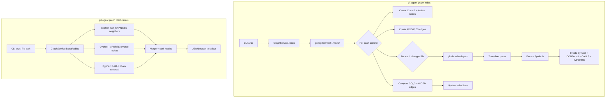

# git-agent graph: Code Knowledge Graph for Coding Agents

## Context

Coding agents (Claude Code, Cursor, Windsurf) lack structural awareness of codebases.
When an agent asks "what will break if I change this function?", today's options are
inadequate: flat `git log` (no relationships), grep (misses semantics), or reading the
whole codebase (context window limits).

A pre-computed graph database over git history + AST structure enables O(1) relationship
lookups that agents can query via CLI subcommands returning machine-parseable JSON.

### Q&A History

- **Technology choice**: KuzuDB embedded (`go-kuzu` v0.11.3) -- Cypher-native property graph
- **AST parser**: `gotreesitter` v0.6.4 (pure Go, zero CGo)
- **Priority**: Blast radius analysis first (primary agent need)
- **Scope**: P0 = git history + co-change; P1 = AST + symbols; P2 = advanced metrics

## Discovery Results

### Codebase Analysis

- Current binary: 7.2MB, 3 direct dependencies (go-openai, cobra, yaml.v3), zero CGo
- Clean Architecture: `cmd -> application -> domain <- infrastructure`
- Domain has zero external imports; KuzuDB and Tree-sitter must live in `infrastructure/`
- Git operations abstracted via `infrastructure/git/client.go` (18 functional methods)
- Config follows 3-tier hierarchy: CLI flags > user config > project config > defaults

### Technology Research

- KuzuDB original archived Oct 2025; `go-kuzu` v0.11.3 is functional, should be vendored
- Active fork: `Vela-Engineering/kuzu` adds concurrent multi-writer (not needed for CLI)
- `gotreesitter` v0.6.4 is pure Go (WASM-compiled grammars), zero CGo penalty
- Bulk COPY FROM is 53x faster than row-by-row INSERT in KuzuDB
- KuzuDB supports concurrent reads; single writer via file lock

See [Research](./research.md) for full KuzuDB and Tree-sitter evaluation findings.

## Requirements

**P0 (v1)**: 10 requirements covering git history indexing, incremental updates,
co-change detection, blast-radius query (file-level), JSON output, CLI subcommands,
storage, gitignore integration, error handling.

**P1 (post-v1)**: 8 requirements covering AST parsing (Tree-sitter), CALLS/IMPORTS
edges, symbol-level blast radius, hotspots, ownership queries.

**P2 (future)**: 6 requirements covering coupling scores, stability metrics, time
windows, graph export, watch mode, MCP server mode.

See [Requirements](./requirements.md) for the full requirements document with success
criteria, constraints, CLI UX design, output format specification, and risk register.

### Traceability Matrix

| Req | Description | Design Section | BDD Scenario |
|-----|-------------|---------------|--------------|
| R01 | Index git history into graph DB | Schema DDL, Index Algorithm | First-time full index |
| R02 | Incremental indexing | Key Decision #3, IndexState | Incremental index after new commits, Idempotent |
| R03 | Co-change detection | CO_CHANGED schema, Key Decision #2 | CO_CHANGED edges computed |
| R04 | Blast radius query (file-level) | Blast Radius Cypher, Data Flow | Blast radius single file, JSON output |
| R05 | JSON output for all queries | Exit Codes, Subcommand Flags | Agent queries via CLI (JSON) |
| R06 | `graph index` subcommand | CLI Command Tree | First-time full index |
| R07 | `graph blast-radius` subcommand | CLI Command Tree, Data Flow | Blast radius scenarios (7) |
| R08 | Storage in `.git-agent/graph.db` | Storage | First-time full index |
| R09 | Gitignore integration | Storage | Auto-adds graph.db to gitignore |
| R10 | Graceful empty/missing graph | Exit Codes | Status when no index, Error outside git repo |
| R11 | AST parsing (Tree-sitter) | Schema (Symbol), Architecture | Multi-language detection, Symbol rebuild |
| R12 | CALLS edges | Schema (CALLS), Data Flow | CALLS extraction from AST |
| R13 | IMPORTS edges | Schema (IMPORTS), Data Flow | IMPORTS extraction |
| R14 | Symbol-level blast radius | Blast Radius Cypher Phase 3 | Blast radius of specific function |
| R15 | Hotspots subcommand | CLI Command Tree | Hotspot ranking, Time window |
| R16 | Ownership subcommand | CLI Command Tree | Ownership by commit count |
| R17 | Incremental AST re-parsing | Key Decision #3 (DELETE+CREATE) | Symbol rebuild on content change |
| R18 | Multi-language AST | Architecture (queries/*.scm) | Multi-language detection |
| R19 | Coupling score (P2) | CO_CHANGED schema | -- |
| R20 | Stability metrics (P2) | -- | Stability module/file (P2) |
| R21 | Time-windowed queries (P2) | Subcommand Flags (--since) | Hotspots with time window |
| R22 | Graph export (P2) | -- | -- |
| R23 | Watch mode (P2) | -- | -- |
| R24 | MCP server mode (P2) | -- | -- |

## Rationale

| Decision | Choice | Rationale |
|----------|--------|-----------|
| Graph DB | KuzuDB embedded (`go-kuzu` v0.11.3) | Embedded, no server, Cypher-native, property graph |
| AST parser | `gotreesitter` v0.6.4 (pure Go) | Zero CGo, 206 grammars, cross-compiles to any GOOS/GOARCH |
| Schema | Hybrid (Commit/File/Symbol/Author + 6 edge types) | Balances git history granularity with AST precision |
| Indexing | Incremental (track last indexed commit hash) | Scales to large repos without full rebuild |
| Interface | CLI subcommands (`git-agent graph ...`) | Agents call via shell, parse JSON stdout |
| Priority | Blast radius analysis first | Primary agent need: "what's affected if I change X?" |

### Alternatives Considered

1. **SQLite (modernc.org/sqlite)**: +6.4MB, no CGo, full SQL with recursive CTEs.
   Rejected because Cypher is more natural for graph traversal and the CGo tradeoff
   is acceptable with build tag isolation.
2. **bbolt + in-memory graph**: +0.6MB, minimal binary impact. Rejected because no
   query language limits future flexibility for ad-hoc graph queries.
3. **Cayley**: Go graph DB but requires CGo via mattn/go-sqlite3, 141 total
   dependencies. Rejected as worse than KuzuDB on all relevant metrics.

## Detailed Design

### Graph Schema (KuzuDB Cypher DDL)

```cypher
-- Node tables
CREATE NODE TABLE IF NOT EXISTS Commit(
    hash STRING PRIMARY KEY,
    message STRING,
    author_name STRING,
    author_email STRING,
    timestamp INT64,
    parent_hashes STRING[]
);

CREATE NODE TABLE IF NOT EXISTS File(
    path STRING PRIMARY KEY,
    language STRING,
    last_indexed_hash STRING
);

CREATE NODE TABLE IF NOT EXISTS Symbol(
    id STRING PRIMARY KEY,     -- "{file_path}:{kind}:{name}:{start_line}"
    name STRING,
    kind STRING,               -- function, method, class, interface, type_alias
    file_path STRING,
    start_line INT64,
    end_line INT64,
    signature STRING
);

CREATE NODE TABLE IF NOT EXISTS Author(
    email STRING PRIMARY KEY,
    name STRING
);

CREATE NODE TABLE IF NOT EXISTS IndexState(
    key STRING PRIMARY KEY,
    value STRING
);

-- Relationship tables
CREATE REL TABLE IF NOT EXISTS AUTHORED(FROM Author TO Commit);

CREATE REL TABLE IF NOT EXISTS MODIFIES(
    FROM Commit TO File,
    additions INT64,
    deletions INT64,
    status STRING              -- A (added), M (modified), D (deleted), R (renamed)
);

CREATE REL TABLE IF NOT EXISTS CONTAINS(FROM File TO Symbol);

CREATE REL TABLE IF NOT EXISTS CALLS(
    FROM Symbol TO Symbol,
    confidence DOUBLE          -- 1.0 exact, 0.8 receiver method, 0.5 fuzzy
);

CREATE REL TABLE IF NOT EXISTS IMPORTS(
    FROM File TO File,
    import_path STRING
);

CREATE REL TABLE IF NOT EXISTS CO_CHANGED(
    FROM File TO File,
    coupling_count INT64,
    coupling_strength DOUBLE,  -- coupling_count / max(commits_a, commits_b)
    last_coupled_hash STRING
);
```

### CLI Command Tree

```
git-agent graph
  index         Build or update the code graph from git history
  blast-radius  Show files/symbols affected by changing a target
  hotspots      Show frequently changed files                    (P1)
  ownership     Show who owns a file or directory                (P1)
  stability     Show change velocity for a path                  (P2)
  clusters      Show co-change clusters                          (P2)
  status        Show graph DB metadata
  reset         Delete the graph DB and start fresh
```

### Subcommand Flags

| Command | Flags | Default |
|---------|-------|---------|
| `index` | `--max-commits N`, `--force`, `--ast`, `--max-files-per-commit N` | unlimited, false, false, 50 |
| `blast-radius` | `--symbol NAME`, `--depth N`, `--top N`, `--min-count N` | file-level, 2, 20, 3 |
| `hotspots` | `--path DIR`, `--top N`, `--since DATE\|DURATION` | repo root, 10, all time |
| `ownership` | `PATH` (positional), `--since DATE\|DURATION` | required, all time |
| All | `--format json\|text`, `--verbose` | json, false |

### Exit Codes

- `0` -- success
- `1` -- general error
- `2` -- hook blocked commit (existing)
- `3` -- graph not indexed (new; agents detect and auto-run `graph index`)

### Storage

- Location: `.git-agent/graph.db/` (KuzuDB directory)
- Metadata: `IndexState` node table inside the graph itself
- Gitignore: `graph index` auto-adds `graph.db/` to `.git-agent/.gitignore`
- Size targets: <10MB for 1k-commit repo, <50MB for 10k-commit repo

### Data Flow



### Key Design Decisions

1. **Natural keys over SERIAL**: Commit hash, file path, composite symbol ID enable
   idempotent MERGE operations. Re-indexing the same commit is a no-op.

2. **CO_CHANGED is derived**: Computed after all commits are indexed, not during.
   Coupling strength = co_occurrences / max(individual_commits_a, individual_commits_b).
   Minimum threshold of 3 co-changes to filter noise from bulk reformats.

3. **Hybrid incremental strategy**:
   - Commits, Authors, MODIFIES, AUTHORED: MERGE (append-only)
   - Symbols, CONTAINS, CALLS, IMPORTS: DELETE+CREATE per changed file
   - CO_CHANGED: Recompute after indexing

4. **Build tag isolation** (`//go:build graph`): go-kuzu requires CGo. Default
   `make build` stays pure Go. `make build-graph` includes KuzuDB. This prevents
   breaking existing builds for non-graph users.

5. **KuzuDB tuning for CLI**:
   - Buffer pool: 256 MB (not default 80% RAM)
   - Thread cap: 4
   - Compression: enabled
   - Read-only mode for query commands

6. **Bulk COPY FROM for initial index**: 53x faster than row-by-row INSERT.
   Incremental updates use MERGE.

### Constraints

- **C1**: `go-kuzu` requires CGo. Mitigated by build tags.
- **C2**: `gotreesitter` pure Go grammars add ~1-3MB per language.
- **C3**: Must follow existing Clean Architecture (domain has zero external imports).
- **C4**: Binary size target: total under 50MB for graph-enabled build (go-kuzu ~20-30MB + gotreesitter ~5-10MB).
- **C5**: Storage target: <50MB for 10k-commit repos.
- **C6**: Fully offline. No LLM calls, no network.

### Performance Targets

| Operation | Target |
|-----------|--------|
| First index, 5k commits | <30 seconds |
| Incremental index, 1 new commit | <2 seconds |
| Blast radius query | <500ms |

### Success Criteria

- Agent can call `git-agent graph blast-radius src/main.go`, parse JSON, and use it
- `make test` passes after merge (existing tests unaffected)
- All P0 requirements covered by unit + e2e tests

## Design Documents

- [BDD Specifications](./bdd-specs.md) -- Behavior scenarios and testing strategy
- [Architecture](./architecture.md) -- System architecture and component details
- [Best Practices](./best-practices.md) -- KuzuDB, Tree-sitter, and performance guidelines
- [Requirements](./requirements.md) -- Full context, requirements, CLI UX, risk register
- [Research](./research.md) -- KuzuDB + Tree-sitter research findings
