# git-agent graph: Code Knowledge Graph for Coding Agents

## Context

Coding agents (Claude Code, Cursor, Windsurf) lack structural awareness of codebases.
When an agent asks "what will break if I change this function?", today's options are
inadequate: flat `git log` (no relationships), grep (misses semantics), or reading the
whole codebase (context window limits).

Beyond structural awareness, agents also lack **behavioral traceability**. When a bug
surfaces, there is no way to answer "which agent action introduced this regression?"
because agent edits (each `Edit`, `Write`, `Bash` tool call) are invisible -- they
collapse into a single git commit, losing the fine-grained action history.

A pre-computed graph stored in SQLite over git history + AST structure + agent/human
action timeline enables fast relationship lookups and behavioral tracing that agents
can query via CLI subcommands returning machine-parseable JSON.

### Q&A History

- **Technology choice**: SQLite via `modernc.org/sqlite` (pure Go, zero CGo)
- **AST parser**: `gotreesitter` (pure Go) + `go/ast` for Go files (higher precision)
- **Priority**: Blast radius analysis first (primary agent need)
- **Scope**: P0 = git history + co-change + blast-radius; P1a = AST + symbols; P1b = action capture + timeline + hooks; P2 = diagnose + LLM compression + advanced metrics
- **Action capture**: Agent hooks (Claude Code `PostToolUse`) feed diffs into graph via `graph capture`
- **Timeline**: LLM-compressed session summaries; raw mode available offline
- **Diagnose**: Combines blast-radius + action timeline to trace bug introduction
- **Build**: Always-on in single binary, no build tags, no CGo

## Discovery Results

### Codebase Analysis

- Current binary: 7.2MB, 3 direct dependencies (go-openai, cobra, yaml.v3), zero CGo
- Clean Architecture: `cmd -> application -> domain <- infrastructure`
- Domain has zero external imports; SQLite and Tree-sitter must live in `infrastructure/`
- Git operations abstracted via `infrastructure/git/client.go`
- Config follows 3-tier hierarchy: CLI flags > user config > project config > defaults

### Technology Research

- **KuzuDB** (original choice): archived Oct 2025, no maintained forks. Go binding
  `go-kuzu` v0.11.3 is also archived. CGo requirement would add 20-30MB and break
  cross-compilation. **Rejected.**
- **SQLite via `modernc.org/sqlite`** (v1.48.1): pure Go transpilation, zero CGo,
  full cross-compilation, +8-12MB binary size. 3,400+ importers, production-grade.
  Recursive CTEs handle graph traversal patterns adequately for per-repo scale
  (thousands of nodes, tens of thousands of edges).
- **`gotreesitter`** (v0.6.4+): pure Go reimplementation of tree-sitter runtime.
  206 grammars, 2.4x slower than native C (fine for offline indexing). Zero CGo.
- **`go/ast`**: Standard library, zero dependency. Perfect precision for Go files.
  Used alongside gotreesitter for Go-specific parsing.

### Technology Comparison

| Criteria | KuzuDB (rejected) | SQLite (chosen) |
|----------|-------------------|-----------------|
| CGo | Required | None (pure Go) |
| Binary impact | +20-30MB | +8-12MB |
| Cross-compilation | Broken by CGo | Works natively |
| Upstream status | Archived Oct 2025 | Active, 3,400+ importers |
| Query language | Cypher (elegant) | SQL + recursive CTEs (verbose but adequate) |
| Graph scale fit | Overkill for per-repo | Right-sized |
| Build complexity | Build tags, separate CI | Single build, single CI job |

## Requirements

**P0 (v1)**: 10 requirements covering git history indexing, incremental updates,
co-change detection, blast-radius query (file-level), JSON output, CLI subcommands,
storage, gitignore integration, error handling.

**P1a (post-v1, structural awareness)**: 8 requirements covering AST parsing
(Tree-sitter), CALLS/IMPORTS edges, symbol-level blast radius, hotspots, ownership
queries, incremental AST re-parsing, multi-language AST.

**P1b (post-P1a, behavioral traceability)**: 6 requirements covering action capture
via agent hooks, session tracking, timeline display, action-to-file attribution,
action-to-commit linking, agent hook integration (Claude Code).

**P2 (future)**: 9 requirements covering LLM timeline compression, diagnose (bug
trace-back), coupling scores, stability metrics, time windows, graph export, watch
mode, MCP server mode.

See [Requirements](./requirements.md) for the full requirements document with success
criteria, constraints, CLI UX design, output format specification, and risk register.

### Traceability Matrix

| Req | Description | Design Section | BDD Scenario |
|-----|-------------|---------------|--------------|
| R01 | Index git history into graph DB | Schema DDL, Index Algorithm | First-time full index |
| R02 | Incremental indexing | Key Decision #3, IndexState | Incremental index after new commits, Idempotent |
| R03 | Co-change detection | co_changed table, Key Decision #2 | CO_CHANGED edges computed |
| R04 | Blast radius query (file-level) | Blast Radius SQL, Data Flow | Blast radius single file, JSON output |
| R05 | JSON output for all queries | Exit Codes, Subcommand Flags | Agent queries via CLI (JSON) |
| R06 | `graph index` subcommand | CLI Command Tree | First-time full index |
| R07 | `graph blast-radius` subcommand | CLI Command Tree, Data Flow | Blast radius scenarios (7) |
| R08 | Storage in `.git-agent/graph.db` | Storage | First-time full index |
| R09 | Gitignore integration | Storage | Auto-adds graph.db to gitignore |
| R10 | Graceful empty/missing graph | Exit Codes | Status when no index, Error outside git repo |
| R11 | AST parsing (Tree-sitter) | Schema (symbols), Architecture | Multi-language detection, Symbol rebuild |
| R12 | CALLS edges | Schema (calls), Data Flow | CALLS extraction from AST |
| R13 | IMPORTS edges | Schema (imports), Data Flow | IMPORTS extraction |
| R14 | Symbol-level blast radius | Blast Radius SQL Phase 3 | Blast radius of specific function |
| R15 | Hotspots subcommand | CLI Command Tree | Hotspot ranking, Time window |
| R16 | Ownership subcommand | CLI Command Tree | Ownership by commit count |
| R17 | Incremental AST re-parsing | Key Decision #3 (DELETE+INSERT) | Symbol rebuild on content change |
| R18 | Multi-language AST | Architecture (queries/*.scm) | Multi-language detection |
| R19 | Action capture via `graph capture` | Session/Action schema, Hook Integration | Capture agent edit action |
| R20 | Session tracking (group actions) | Session schema, Data Flow | Session lifecycle |
| R21 | Agent hook integration (Claude Code) | Hook Integration | Claude Code PostToolUse hook triggers capture |
| R22 | `graph timeline` subcommand | CLI Command Tree, Data Flow | Timeline raw, Timeline filtered |
| R23 | Action-to-file attribution | action_modifies schema | Action modifies tracked files |
| R24 | Action-to-commit linking | action_produces schema | Actions linked to resulting commit (via git-agent commit) |
| R25 | LLM timeline compression (P2) | Key Decision #8, Data Flow | Timeline compressed |
| R26 | `graph diagnose` subcommand (P2) | CLI Command Tree, Data Flow | Diagnose traces bug to action |
| R27 | Coupling score (P2) | co_changed table | -- |
| R28 | Stability metrics (P2) | -- | Stability module/file (P2) |
| R29 | Time-windowed queries on all commands (P2) | Subcommand Flags (--since/--until) | -- (P1a hotspots --since is part of R15) |
| R30 | Graph export (P2) | -- | -- |
| R31 | Watch mode (P2) | -- | -- |
| R32 | MCP server mode (P2) | -- | -- |

## Rationale

| Decision | Choice | Rationale |
|----------|--------|-----------|
| Graph DB | SQLite via `modernc.org/sqlite` | Pure Go, zero CGo, cross-compiles, +8-12MB, active upstream |
| AST parser | `gotreesitter` + `go/ast` for Go | Pure Go, 206 grammars; `go/ast` gives perfect Go precision |
| Schema | Relational tables modeling a property graph | Natural keys enable idempotent INSERT OR REPLACE |
| Indexing | Incremental (track last indexed commit hash) | Scales to large repos without full rebuild |
| Interface | CLI subcommands (`git-agent graph ...`) | Agents call via shell, parse JSON stdout |
| Build | Always-on, single binary, no build tags | SQLite is pure Go; no reason to split builds |
| Priority | P0 blast radius, P1a AST, P1b actions, P2 diagnose | Ship structural awareness first, behavioral tracing second |
| Action capture | Delta-based via agent hooks (PostToolUse) | capture_baseline prevents diff accumulation across tool calls |
| Timeline | LLM compression optional, raw mode offline | Keeps offline default; LLM enrichment is opt-in |
| Diagnose | Combines blast-radius + action timeline | AI-enhanced `git bisect` at action granularity |
| History rewrite | Auto-detect via merge-base, fall back to full re-index | Prevents silent corruption from force-push/rebase |
| Rename tracking | `renames` table populated during indexing | Preserves co-change continuity across file renames |
| Schema migration | Version key in index_state, forward migrations | Avoids unnecessary `graph reset` on minor upgrades |

### Alternatives Considered

1. **KuzuDB embedded (`go-kuzu` v0.11.3)**: Cypher-native property graph, elegant
   query language. Rejected: archived Oct 2025, requires CGo (+20-30MB), breaks
   cross-compilation, no maintained forks.
2. **bbolt + in-memory graph**: +0.6MB, minimal binary impact. Rejected: no query
   language limits future flexibility for ad-hoc graph queries.
3. **Cayley**: Go graph DB but requires CGo via mattn/go-sqlite3, 141 total
   dependencies. Rejected: worse than SQLite on all relevant metrics.
4. **No DB, JSON/CSV**: Simplest storage. Rejected: doesn't scale for incremental
   updates and ad-hoc queries.

## Detailed Design

### SQLite Schema

```sql
-- Core node tables
CREATE TABLE IF NOT EXISTS commits (
    hash TEXT PRIMARY KEY,
    message TEXT,
    author_name TEXT,
    author_email TEXT,
    timestamp INTEGER,
    parent_hashes TEXT  -- JSON array: '["abc123","def456"]'
);

CREATE TABLE IF NOT EXISTS files (
    path TEXT PRIMARY KEY,
    language TEXT,
    last_indexed_hash TEXT
);

CREATE TABLE IF NOT EXISTS symbols (
    id TEXT PRIMARY KEY,     -- "{file_path}:{kind}:{name}:{start_line}"
    name TEXT NOT NULL,
    kind TEXT NOT NULL,      -- function, method, class, interface, type_alias
    file_path TEXT NOT NULL,
    start_line INTEGER,
    end_line INTEGER,
    signature TEXT,
    FOREIGN KEY (file_path) REFERENCES files(path)
);

CREATE TABLE IF NOT EXISTS authors (
    email TEXT PRIMARY KEY,
    name TEXT
);

-- Edge tables (relationships)
CREATE TABLE IF NOT EXISTS authored (
    author_email TEXT NOT NULL,
    commit_hash TEXT NOT NULL,
    PRIMARY KEY (author_email, commit_hash),
    FOREIGN KEY (author_email) REFERENCES authors(email),
    FOREIGN KEY (commit_hash) REFERENCES commits(hash)
);

CREATE TABLE IF NOT EXISTS modifies (
    commit_hash TEXT NOT NULL,
    file_path TEXT NOT NULL,
    additions INTEGER DEFAULT 0,
    deletions INTEGER DEFAULT 0,
    status TEXT,          -- A (added), M (modified), D (deleted), R (renamed)
    PRIMARY KEY (commit_hash, file_path),
    FOREIGN KEY (commit_hash) REFERENCES commits(hash),
    FOREIGN KEY (file_path) REFERENCES files(path)
);

CREATE TABLE IF NOT EXISTS contains_symbol (
    file_path TEXT NOT NULL,
    symbol_id TEXT NOT NULL,
    PRIMARY KEY (file_path, symbol_id),
    FOREIGN KEY (file_path) REFERENCES files(path),
    FOREIGN KEY (symbol_id) REFERENCES symbols(id)
);

CREATE TABLE IF NOT EXISTS calls (
    from_symbol TEXT NOT NULL,
    to_symbol TEXT NOT NULL,
    confidence REAL DEFAULT 1.0,  -- 1.0 exact, 0.8 receiver, 0.5 fuzzy
    PRIMARY KEY (from_symbol, to_symbol),
    FOREIGN KEY (from_symbol) REFERENCES symbols(id),
    FOREIGN KEY (to_symbol) REFERENCES symbols(id)
);

CREATE TABLE IF NOT EXISTS imports (
    from_file TEXT NOT NULL,
    to_file TEXT NOT NULL,
    import_path TEXT,
    PRIMARY KEY (from_file, to_file),
    FOREIGN KEY (from_file) REFERENCES files(path),
    FOREIGN KEY (to_file) REFERENCES files(path)
);

CREATE TABLE IF NOT EXISTS co_changed (
    file_a TEXT NOT NULL,
    file_b TEXT NOT NULL,
    coupling_count INTEGER DEFAULT 0,
    coupling_strength REAL DEFAULT 0.0,
    last_coupled_hash TEXT,
    PRIMARY KEY (file_a, file_b),
    FOREIGN KEY (file_a) REFERENCES files(path),
    FOREIGN KEY (file_b) REFERENCES files(path),
    CHECK (file_a < file_b)  -- canonical ordering prevents duplicates
);

-- Session/Action tables (P1b)
CREATE TABLE IF NOT EXISTS sessions (
    id TEXT PRIMARY KEY,          -- UUID
    source TEXT NOT NULL,         -- "claude-code", "cursor", "windsurf", "human"
    instance_id TEXT,             -- distinguishes concurrent agents of same source (e.g., PID)
    started_at INTEGER NOT NULL,
    ended_at INTEGER,
    summary TEXT                  -- LLM-compressed (nullable, filled by timeline --compress)
);

CREATE TABLE IF NOT EXISTS actions (
    id TEXT PRIMARY KEY,          -- "{session_id}:{sequence_number}"
    session_id TEXT NOT NULL,
    sequence INTEGER NOT NULL DEFAULT 0,
    tool TEXT,                    -- "Edit", "Write", "Bash", "manual-save", null
    diff TEXT,                    -- unified diff (truncated at 100KB)
    files_changed TEXT,           -- JSON array: '["src/main.go"]'
    timestamp INTEGER NOT NULL,
    message TEXT,
    summary TEXT,                 -- LLM-compressed (nullable)
    FOREIGN KEY (session_id) REFERENCES sessions(id)
);

CREATE TABLE IF NOT EXISTS action_modifies (
    action_id TEXT NOT NULL,
    file_path TEXT NOT NULL,
    additions INTEGER DEFAULT 0,
    deletions INTEGER DEFAULT 0,
    PRIMARY KEY (action_id, file_path),
    FOREIGN KEY (action_id) REFERENCES actions(id),
    FOREIGN KEY (file_path) REFERENCES files(path)
);

CREATE TABLE IF NOT EXISTS action_produces (
    action_id TEXT NOT NULL,
    commit_hash TEXT NOT NULL,
    PRIMARY KEY (action_id, commit_hash),
    FOREIGN KEY (action_id) REFERENCES actions(id),
    FOREIGN KEY (commit_hash) REFERENCES commits(hash)
);

-- Capture baseline tracking (delta-based action capture)
CREATE TABLE IF NOT EXISTS capture_baseline (
    file_path TEXT PRIMARY KEY,
    content_hash TEXT NOT NULL,    -- git hash-object of file at last capture
    captured_at INTEGER NOT NULL
);

-- File rename tracking
CREATE TABLE IF NOT EXISTS renames (
    old_path TEXT NOT NULL,
    new_path TEXT NOT NULL,
    commit_hash TEXT NOT NULL,
    PRIMARY KEY (old_path, new_path, commit_hash),
    FOREIGN KEY (commit_hash) REFERENCES commits(hash)
);

-- Index state (metadata)
CREATE TABLE IF NOT EXISTS index_state (
    key TEXT PRIMARY KEY,
    value TEXT
);

-- Performance indexes
CREATE INDEX IF NOT EXISTS idx_commits_timestamp ON commits(timestamp);
CREATE INDEX IF NOT EXISTS idx_modifies_file ON modifies(file_path);
CREATE INDEX IF NOT EXISTS idx_modifies_commit ON modifies(commit_hash);
CREATE INDEX IF NOT EXISTS idx_symbols_file ON symbols(file_path);
CREATE INDEX IF NOT EXISTS idx_symbols_name ON symbols(name);
CREATE INDEX IF NOT EXISTS idx_co_changed_file_a ON co_changed(file_a);
CREATE INDEX IF NOT EXISTS idx_co_changed_file_b ON co_changed(file_b);
CREATE INDEX IF NOT EXISTS idx_co_changed_strength ON co_changed(coupling_strength);
CREATE INDEX IF NOT EXISTS idx_actions_session ON actions(session_id);
CREATE INDEX IF NOT EXISTS idx_actions_timestamp ON actions(timestamp);
CREATE INDEX IF NOT EXISTS idx_action_modifies_file ON action_modifies(file_path);
CREATE INDEX IF NOT EXISTS idx_sessions_source_instance ON sessions(source, instance_id);
CREATE INDEX IF NOT EXISTS idx_renames_old ON renames(old_path);
CREATE INDEX IF NOT EXISTS idx_renames_new ON renames(new_path);
```

### CLI Command Tree

```
git-agent graph
  index         Build or update the code graph from git history
  blast-radius  Show files/symbols affected by changing a target
  capture       Record an agent/human action into the graph       (P1b)
  timeline      Show session/action history with optional compression (P1b)
  hotspots      Show frequently changed files                    (P1a)
  ownership     Show who owns a file or directory                (P1a)
  diagnose      Trace a bug back to the introducing action       (P2)
  coupling      Show coupling score between two paths            (P2)
  stability     Show change velocity for a path                  (P2)
  clusters      Show co-change clusters                          (P2)
  status        Show graph DB metadata
  reset         Delete the graph DB and start fresh
```

### Subcommand Flags

| Command | Flags | Default |
|---------|-------|---------|
| `index` | `--max-commits N`, `--force`, `--ast`, `--max-files-per-commit N`, `--co-change-full-threshold N` | unlimited, false, false, 50, 500 |
| `blast-radius` | `--symbol NAME`, `--depth N`, `--top N`, `--min-count N` | file-level, 2, 20, 3 |
| `capture` | `--source NAME`, `--tool NAME`, `--session ID`, `--instance-id ID`, `--message TEXT` | required, null, auto-create, $PPID, null |
| `timeline` | `--since DATE\|DURATION`, `--until DATE`, `--source NAME`, `--file PATH`, `--compress`, `--top N` | all, now, all, all, false, 50 |
| `hotspots` | `--path DIR`, `--top N`, `--since DATE\|DURATION` | repo root, 10, all time |
| `ownership` | `PATH` (positional), `--since DATE\|DURATION` | required, all time |
| `diagnose` | `DESCRIPTION\|PATH` (positional), `--since DATE\|DURATION`, `--depth N` | required, 7d, 3 |
| All | `--format json\|text`, `--verbose` | json, false |

### Exit Codes

- `0` -- success
- `1` -- general error
- `2` -- hook blocked commit (existing)
- `3` -- graph not indexed (new; agents detect and auto-run `graph index`)

### Storage

- Location: `.git-agent/graph.db` (single SQLite file)
- Metadata: `index_state` table inside the database
- Gitignore: `graph index` auto-adds `graph.db` to `.git-agent/.gitignore`
- Size targets: <10MB for 1k-commit repo, <50MB for 10k-commit repo
- Concurrency: WAL mode enables concurrent reads during writes

### Data Flow

```mermaid
graph TD
    subgraph "git-agent graph index"
        A[CLI args] --> B[GraphService.Index]
        B --> B2{lastHash reachable from HEAD?}
        B2 -->|No: force-push/rebase| B3[Fall back to full re-index]
        B2 -->|Yes| C[git log lastHash..HEAD]
        B3 --> C
        C --> D{For each commit}
        D --> E[INSERT OR IGNORE Commit + Author]
        D --> F[INSERT modifies edges]
        D --> F2{Rename detected?}
        F2 -->|Yes| F3[INSERT renames row]
        F2 -->|No| G
        F3 --> G
        D --> G{For each changed file}
        G --> H[git show hash:path]
        H --> I[Tree-sitter / go/ast parse]
        I --> J[Extract Symbols]
        J --> K[DELETE old + INSERT symbols, calls, imports]
        D --> L[Incremental co_changed update for touched files]
        L --> M[UPDATE index_state + schema_version]
    end

    subgraph "git-agent graph blast-radius"
        N[CLI args: file path] --> N2[Resolve renames: union old+new paths]
        N2 --> O[GraphService.BlastRadius]
        O --> P[SQL: co_changed neighbors]
        O --> Q[SQL: imports reverse lookup]
        O --> R[SQL: recursive CTE call chain]
        P --> S[Merge + rank + deduplicate results]
        Q --> S
        R --> S
        S --> T[JSON output to stdout]
    end

    subgraph "git-agent graph capture (P1b, called by agent hook)"
        CA[Hook trigger] --> CB[CaptureService.Capture]
        CB --> CB2[git diff --name-only: changed files]
        CB2 --> CB3[Load capture_baseline hashes]
        CB3 --> CB4[Compute delta: hash-object vs baseline]
        CB4 --> CB5{Delta files exist?}
        CB5 -->|No| CI2[Return skipped]
        CB5 -->|Yes| CC{Session exists for source+instance?}
        CC -->|No| CD[INSERT session]
        CC -->|Yes| CE[Reuse session]
        CD --> CF[git diff only delta files]
        CE --> CF
        CF --> CG[INSERT action with delta diff]
        CG --> CH[INSERT action_modifies for delta files only]
        CH --> CJ[UPDATE capture_baseline hashes]
        CJ --> CI[Return action ID]
    end

    subgraph "git-agent graph timeline (P1b)"
        TA[CLI args: filters] --> TB[CaptureService.Timeline]
        TB --> TC[SQL: sessions + actions in range]
        TC --> TD{--compress flag?}
        TD -->|No| TE[Return raw action list]
        TD -->|Yes| TF[Group actions by session]
        TF --> TG[LLM: compress each session into summary]
        TG --> TH[Return compressed timeline]
    end

    subgraph "git-agent graph diagnose (P2)"
        DA[Bug description / file path] --> DB[DiagnoseService.Diagnose]
        DB --> DC[BlastRadius: find affected files]
        DB --> DD[Timeline: find actions touching those files]
        DC --> DE[Intersect: actions on affected files]
        DD --> DE
        DE --> DF[LLM: rank actions by likelihood]
        DF --> DG[Return suspects with diffs + suggested fix]
    end
```



### Key Design Decisions

1. **Natural keys over synthetic IDs**: Commit hash, file path, composite symbol ID
   enable idempotent INSERT OR REPLACE / INSERT OR IGNORE operations. Re-indexing
   the same commit is a no-op.

2. **co_changed canonical ordering**: `CHECK (file_a < file_b)` constraint ensures
   each pair is stored once. Coupling strength = co_occurrences /
   max(individual_commits_a, individual_commits_b). Minimum threshold of 3
   co-changes filters noise from bulk reformats.

3. **Hybrid incremental strategy**:
   - Commits, Authors, authored, modifies: INSERT OR IGNORE (append-only)
   - Symbols, contains_symbol, calls, imports: DELETE by file_path + INSERT
   - co_changed: Incremental update -- recompute only pairs involving files
     modified in newly indexed commits. Full recompute on `--force` or when
     newly indexed commits exceed 500 (threshold configurable via
     `--co-change-full-threshold`). This avoids O(n^2) self-join on the
     entire modifies table for every incremental index.

4. **Always-on in single binary**: SQLite via `modernc.org/sqlite` is pure Go.
   No CGo, no build tag isolation, no separate build targets. The `graph`
   subcommand group is always available. Binary size increase (~8-12MB for SQLite
   + ~5-10MB for gotreesitter grammars) is acceptable for a modern CLI tool.

5. **SQLite tuning for CLI**:
   - WAL journal mode (concurrent reads during writes)
   - `synchronous=NORMAL` (safe for a local cache that can be rebuilt)
   - 64MB page cache, 256MB mmap
   - Read-only mode for query commands

6. **Batch inserts via transactions**: Wrap each indexing batch in
   `BEGIN`/`COMMIT`. Prepared statements with parameter binding. Expected
   throughput: 50-100K inserts/second. No need for KuzuDB-style bulk COPY FROM.

7. **Action capture is hook-driven, not polling**: Agent hooks (Claude Code
   `PostToolUse`) call `git-agent graph capture` with the current `git diff`.
   This gives precise per-tool-call attribution. Human edits fall back to
   commit-level granularity.

8. **Timeline has two modes: raw (offline) and compressed (LLM)**:
   `graph timeline` without `--compress` returns raw actions -- fully offline.
   `--compress` calls the configured LLM endpoint to produce human-readable
   summaries. Offline-first principle preserved.

9. **Diagnose combines graph queries + LLM reasoning**: `graph diagnose` first
   uses blast-radius and timeline queries (offline, fast) to narrow candidates,
   then passes candidates + diffs to an LLM for causal analysis.

10. **Session lifecycle is implicit**: A session starts on the first `capture`
    call with no active session. Ends after 30 minutes of inactivity, or
    explicitly via `capture --end-session`. Sessions are scoped by
    `source + instance_id` so concurrent agents of the same type (e.g., two
    Claude Code terminals) maintain separate sessions. `instance_id` defaults
    to the parent process PID (`$PPID`) when not explicitly provided.

11. **Delta-based action capture**: Each `capture` call tracks file content
    hashes in a `capture_baseline` table. Only files whose `git hash-object`
    hash differs from the baseline are attributed to the new action. This
    prevents diff accumulation where later captures would incorrectly include
    changes from prior tool calls that were not yet staged or committed.
    The baseline is updated after every successful capture. On `graph reset`,
    the baseline is cleared. On `capture --end-session`, the baseline is
    preserved (the next session starts with accurate state).

12. **Force-push / history rewrite recovery**: Before incremental indexing,
    verify `last_indexed_commit` is reachable from HEAD via
    `git merge-base --is-ancestor`. If not (force-push, rebase, or
    `filter-branch`), automatically fall back to full re-index. This adds
    one git command (~10ms) to every incremental index but prevents silent
    data corruption from orphaned commit references.

13. **File rename tracking**: Git rename status (`R`) is parsed into a
    `renames` table mapping `old_path -> new_path -> commit_hash`.
    Blast-radius queries union results from all historical paths via
    the renames table, preserving co-change history across renames. Renames
    are populated during indexing when `modifies.status` starts with `R`.
    Multi-hop chains (A->B->C) are resolved via recursive SQL query on the
    renames table (`ResolveRenames` follows the chain to collect all paths).

14. **Schema versioning**: The `index_state` table stores a `schema_version`
    key. On `Open`, the client checks the stored version against the current
    code version. If the version is older, the client runs forward migrations
    (ALTER TABLE ADD COLUMN, CREATE TABLE IF NOT EXISTS). If migration is not
    possible (major version bump), the client returns an error suggesting
    `graph reset`. Action/session data loss on reset is acceptable since the
    graph is a cache that can be rebuilt -- except for action history, which
    is logged as a warning.

### Constraints

- **C1**: `modernc.org/sqlite` adds ~8-12MB to binary. Acceptable.
- **C2**: `gotreesitter` pure Go grammars add ~1-3MB per language.
- **C3**: Must follow existing Clean Architecture (domain has zero external imports).
- **C4**: Binary size target: total under 35MB (SQLite ~8-12MB + gotreesitter ~5-10MB).
- **C5**: Storage target: <50MB for 10k-commit repos.
- **C6**: Offline by default. `index`, `blast-radius`, `capture`, `timeline` (raw),
  `status`, `reset` require no network. `timeline --compress` and `diagnose`
  require LLM access.
- **C7**: Action capture must be fast (<200ms). Minimal work: read diff, write rows, exit.
- **C8**: Diff storage: TEXT column in SQLite. Diffs exceeding 100KB are truncated.
- **C9**: Capture must use delta-based tracking (capture_baseline table) to
  attribute only new changes per action. Raw `git diff` accumulates across
  tool calls and would produce incorrect file attribution.

### Performance Targets

| Operation | Target |
|-----------|--------|
| First index, 5k commits | <30 seconds |
| Incremental index, 1 new commit | <2 seconds |
| Blast radius query | <500ms |
| `graph capture` (single action) | <200ms |
| `graph timeline` (raw, 100 actions) | <300ms |
| `graph timeline --compress` (100 actions) | <10 seconds (LLM-bound) |
| `graph diagnose` | <30 seconds (LLM-bound) |

### Success Criteria

- Agent can call `git-agent graph blast-radius src/main.go`, parse JSON, and use it
- Claude Code `PostToolUse` hook calls `graph capture`, actions appear in `graph timeline`
- `graph diagnose "bug description"` identifies the likely introducing action
- `make test` passes after merge (existing tests unaffected)
- All P0 requirements covered by unit + e2e tests
- Single binary, single build, zero CGo

### Hook Integration (P1b)

Agent hooks are the primary mechanism for feeding action data into the graph.

**Claude Code** (`~/.claude/settings.json`):
```jsonc
{
  "hooks": {
    "PostToolUse": [
      {
        "matcher": { "tool_name": "Edit|Write|Bash" },
        "command": "git-agent graph capture --source claude-code --tool $CLAUDE_TOOL_NAME --instance-id $PPID"
      }
    ]
  }
}
```

The `capture` command uses **delta-based tracking** to attribute only new
changes to each action, avoiding diff accumulation across tool calls:
1. Lists changed files via `git diff --name-only` (unstaged + staged)
2. For each changed file, computes content hash:
   - File exists on disk: `git hash-object <file>`
   - File deleted (in diff but missing from disk): sentinel hash `"deleted"`
3. Loads previous hashes from `capture_baseline` table
4. Computes delta: files whose hash differs from baseline (or absent from baseline)
5. If no delta files exist, exits 0 immediately (no-op)
6. Generates diff for delta files only: `git diff -- <delta files>`
7. Creates or reuses a Session row (keyed by source + instance_id + timeout)
8. Creates an Action row with the delta diff, tool name, and timestamp
9. Creates action_modifies rows for delta files only
10. Updates capture_baseline with current hashes for all changed files
11. Exits 0 (must never block the agent)

**Other agents**: Cursor and Windsurf lack native hook systems. Integration
options (P2):
- VS Code extension `onDidSaveTextDocument` callback
- Git `post-commit` hook for commit-level capture (coarser but universal)

## Design Documents

- [BDD Specifications](./bdd-specs.md) -- Behavior scenarios and testing strategy
- [Architecture](./architecture.md) -- System architecture and component details
- [Best Practices](./best-practices.md) -- SQLite, Tree-sitter, and performance guidelines
- [Requirements](./requirements.md) -- Full context, requirements, CLI UX, risk register
