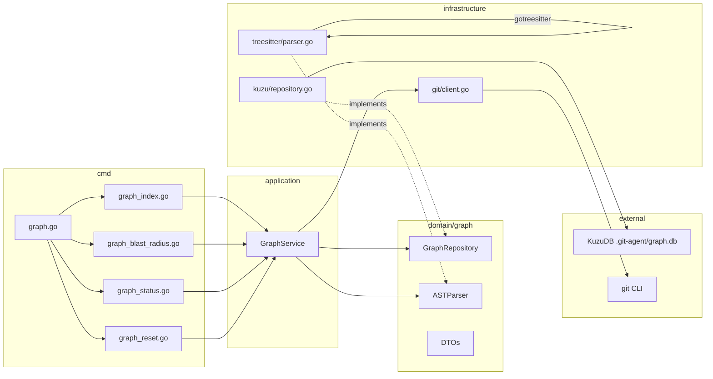

# Architecture: git-agent graph

## Clean Architecture Placement

The graph feature follows the existing 4-layer inward-dependency pattern:

```
cmd/graph*.go  -->  application/graph_*.go  -->  domain/graph/  <--  infrastructure/graph/
                                                                <--  infrastructure/treesitter/
```

Domain has zero external imports. KuzuDB and Tree-sitter live exclusively in
`infrastructure/`.

## Package Structure

```
git-agent-cli/
  domain/
    graph/
      repository.go          # GraphRepository interface
      index.go               # IndexRequest, IndexResult, IndexStatus DTOs
      query.go               # BlastRadiusRequest, BlastRadiusResult, etc.
      nodes.go               # CommitNode, FileNode, SymbolNode, AuthorNode
      edges.go               # Edge types, CO_CHANGED weight

  application/
    graph_service.go          # GraphService: Index, BlastRadius, Hotspots, Ownership, Status, Reset

  infrastructure/
    graph/
      kuzu_client.go          # KuzuDB connection, schema DDL, lifecycle
      kuzu_repository.go      # GraphRepository impl: MERGE, COPY FROM, Cypher queries
      indexer.go              # Git history walker + incremental logic
      co_change.go            # CO_CHANGED edge computation

    treesitter/
      parser.go               # Language detection + gotreesitter wrapper
      extractor.go            # Symbol extraction (functions, classes, calls, imports)
      queries/                # Embedded .scm query files per language
        go.scm
        typescript.scm
        python.scm
        rust.scm
        java.scm

  cmd/
    graph.go                  # Root "graph" command (Cobra)
    graph_index.go            # "graph index" subcommand
    graph_blast_radius.go     # "graph blast-radius" subcommand
    graph_hotspots.go         # "graph hotspots" subcommand (P1)
    graph_ownership.go        # "graph ownership" subcommand (P1)
    graph_status.go           # "graph status" subcommand
    graph_reset.go            # "graph reset" subcommand

  pkg/
    graph/
      format.go               # JSON/text output formatting for graph results
```

## Domain Interfaces

### GraphRepository

```go
type GraphRepository interface {
    // Lifecycle
    Open(ctx context.Context) error
    Close() error
    InitSchema(ctx context.Context) error
    Drop(ctx context.Context) error

    // Write (indexing)
    UpsertCommit(ctx context.Context, c CommitNode) error
    UpsertAuthor(ctx context.Context, a AuthorNode) error
    UpsertFile(ctx context.Context, f FileNode) error
    CreateModifies(ctx context.Context, commitHash, filePath, status string, additions, deletions int) error
    CreateAuthored(ctx context.Context, authorEmail, commitHash string) error
    ReplaceFileSymbols(ctx context.Context, filePath string, symbols []SymbolNode, calls []CallEdge, imports []ImportEdge) error
    RecomputeCoChanged(ctx context.Context, minCount int) error

    // State
    GetLastIndexedCommit(ctx context.Context) (string, error)
    SetLastIndexedCommit(ctx context.Context, hash string) error
    GetStats(ctx context.Context) (*GraphStats, error)

    // Read (queries)
    BlastRadius(ctx context.Context, req BlastRadiusRequest) (*BlastRadiusResult, error)
    Hotspots(ctx context.Context, req HotspotsRequest) (*HotspotsResult, error)
    Ownership(ctx context.Context, req OwnershipRequest) (*OwnershipResult, error)

    // Raw Cypher (power user)
    Query(ctx context.Context, cypher string, params map[string]any) ([]map[string]any, error)
}
```

### ASTParser

```go
type ASTParser interface {
    Parse(ctx context.Context, language string, source []byte) (*ParseResult, error)
    SupportedLanguages() []string
}

type ParseResult struct {
    Symbols []SymbolNode
    Calls   []CallEdge    // {from: symbol ID, to: symbol name, confidence}
    Imports []ImportEdge  // {from: file path, import_path: raw string, resolved: file path}
}
```

## Application Service

```go
type GraphService struct {
    repo   graph.GraphRepository
    parser graph.ASTParser
    git    GraphGitClient
}

// GraphGitClient extends the existing git client interface
type GraphGitClient interface {
    CommitLogDetailed(ctx context.Context, since string, max int) ([]graph.CommitInfo, error)
    FileContentAt(ctx context.Context, commitHash, filePath string) ([]byte, error)
    CurrentHead(ctx context.Context) (string, error)
}
```

### Methods

| Method | Description |
|--------|-------------|
| `Index(ctx, req IndexRequest) (*IndexResult, error)` | Full or incremental index |
| `BlastRadius(ctx, req BlastRadiusRequest) (*BlastRadiusResult, error)` | Co-change + call chain |
| `Hotspots(ctx, req HotspotsRequest) (*HotspotsResult, error)` | Ranked change frequency |
| `Ownership(ctx, req OwnershipRequest) (*OwnershipResult, error)` | Author contribution |
| `Status(ctx) (*GraphStatus, error)` | DB metadata + node/edge counts |
| `Reset(ctx) error` | Drop database directory |

## CLI Wiring (Cobra)

Following the existing pattern in `cmd/commit.go` and `cmd/init.go`:

```go
// cmd/graph.go
var graphCmd = &cobra.Command{
    Use:   "graph",
    Short: "Query the code knowledge graph",
}

func init() {
    graphCmd.AddCommand(graphIndexCmd)
    graphCmd.AddCommand(graphBlastRadiusCmd)
    graphCmd.AddCommand(graphStatusCmd)
    graphCmd.AddCommand(graphResetCmd)
    rootCmd.AddCommand(graphCmd)
}
```

Each subcommand constructs the service with wired dependencies:

```go
// cmd/graph_index.go
var graphIndexCmd = &cobra.Command{
    Use:   "index",
    Short: "Build or update the code graph",
    RunE: func(cmd *cobra.Command, args []string) error {
        repo := kuzu.NewRepository(graphDBPath())
        parser := treesitter.NewParser()
        gitClient := git.NewClient()
        svc := application.NewGraphService(repo, parser, gitClient)
        defer repo.Close()

        result, err := svc.Index(cmd.Context(), application.IndexRequest{
            Force:             force,
            MaxCommits:        maxCommits,
            AST:               ast,
            MaxFilesPerCommit: maxFilesPerCommit,
        })
        // ... format and output result
    },
}
```

## Index Algorithm

```
1. Open KuzuDB at .git-agent/graph.db (create if missing)
2. InitSchema (CREATE NODE/REL TABLE IF NOT EXISTS)
3. Read IndexState.last_indexed_commit
4. git log lastHash..HEAD --format=... --name-status
5. For each commit (in chronological order):
   a. MERGE Commit node
   b. MERGE Author node + AUTHORED edge
   c. For each modified file:
      - MERGE File node
      - CREATE MODIFIES edge
      - If --ast and file extension is supported:
        * git show commitHash:filePath
        * Tree-sitter parse -> extract symbols, calls, imports
        * ReplaceFileSymbols (DELETE old + CREATE new)
6. RecomputeCoChanged (MERGE CO_CHANGED edges)
7. SetLastIndexedCommit(HEAD)
8. Return IndexResult with stats
```

For initial full index (no lastHash), use COPY FROM with temporary CSV files
for bulk loading. This is 53x faster than row-by-row MERGE.

## Blast Radius Query

Two-phase query:

**Phase 1: Co-change neighbors**
```cypher
MATCH (target:File {path: $path})-[cc:CO_CHANGED]-(neighbor:File)
WHERE cc.coupling_count >= $minCount
RETURN neighbor.path, cc.coupling_count, cc.coupling_strength, 'co-change' AS reason
ORDER BY cc.coupling_strength DESC
LIMIT $top
```

**Phase 2: Import/call chain** (when AST is indexed)
```cypher
MATCH (target:File {path: $path})-[:CONTAINS]->(sym:Symbol)
      -[:CALLS*1..$depth]->(callee:Symbol)<-[:CONTAINS]-(caller_file:File)
WHERE caller_file.path <> target.path
RETURN DISTINCT caller_file.path, 'call-dependency' AS reason
```

```cypher
MATCH (importer:File)-[:IMPORTS]->(target:File {path: $path})
RETURN importer.path, 'imports' AS reason
```

**Phase 3: Symbol-level entry point** (when `--symbol` is provided instead of file path)
```cypher
MATCH (target:Symbol)
WHERE target.name = $symbolName AND target.file_path = $filePath
MATCH (caller:Symbol)-[:CALLS*1..$depth]->(target)
RETURN DISTINCT
    caller.file_path AS file,
    caller.name AS symbol,
    caller.kind AS kind
ORDER BY file
```

Results are merged, deduplicated, and ranked.

## Build Tag Isolation

```go
//go:build graph

package kuzu

import kuzu "github.com/kuzudb/go-kuzu"
// ...
```

- `make build` -- pure Go, no CGo, no graph support
- `make build-graph` -- `go build -tags graph`, includes KuzuDB
- `make test` -- tests pass without graph tag (graph tests skip)
- `make test-graph` -- `go test -tags graph ./...`

The `cmd/graph.go` file conditionally registers the command:

```go
//go:build graph

func init() {
    rootCmd.AddCommand(graphCmd)
}
```

Without the build tag, `git-agent graph` is not available.

## Concurrency and Locking

- **Index**: Single writer. Use file lock (`.git-agent/graph.lock`) to prevent
  concurrent indexing from multiple terminals.
- **Query**: KuzuDB supports concurrent reads. Open in read-only mode.
- **Reset**: Acquire write lock, then delete directory.

## Error Handling

- Graph not indexed: exit code 3 with `{"error": "graph not indexed", "hint": "run 'git-agent graph index'"}`
- KuzuDB corruption: `graph reset` provides manual recovery
- Lock contention: `{"error": "graph is being indexed by another process"}`
- Unsupported language (AST): Skip file, log warning in verbose mode

## Mermaid: Component Diagram


