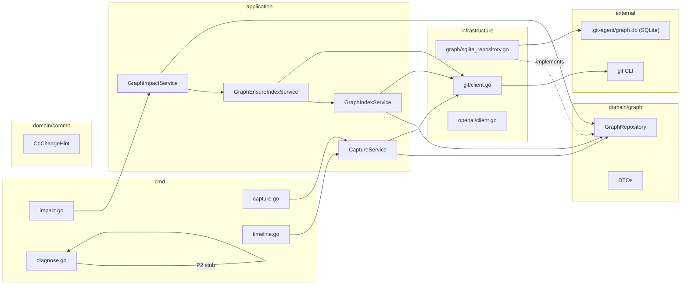

# Architecture: git-agent graph

## Clean Architecture Placement

The graph feature follows the existing 4-layer inward-dependency pattern:

```
cmd/impact.go      -->  application/graph_*.go  -->  domain/graph/  <--  infrastructure/graph/
cmd/capture.go
cmd/timeline.go
cmd/diagnose.go
```

Domain has zero external imports. SQLite (`modernc.org/sqlite`) lives exclusively
in `infrastructure/`.

## Always-On Binary

The graph feature is compiled into every `git-agent` binary. There is no
`//go:build graph` tag, no separate `make build-graph` target, and no
conditional command registration. The graph commands are always available.

This simplifies distribution, CI, and user experience: one binary, one build,
one test invocation. The pure-Go SQLite driver (`modernc.org/sqlite`) requires
no CGo, no system libraries, and no platform-specific build steps.

## Package Structure

```
git-agent-cli/
  domain/
    graph/
      repository.go          # GraphRepository interface
      index.go               # IndexRequest, IndexResult, IndexStatus DTOs
      query.go               # ImpactRequest, ImpactResult DTOs
      session.go             # SessionNode, ActionNode, CaptureRequest, CaptureResult DTOs
      timeline.go            # TimelineRequest, TimelineResult DTOs
      nodes.go               # CommitNode, FileNode, AuthorNode
      edges.go               # Edge types, CO_CHANGED weight
    commit/
      planner.go             # CoChangeHint type (for commit enhancement)

  application/
    graph_index_service.go    # GraphIndexService: Index (full + incremental)
    graph_ensure_index.go     # GraphEnsureIndexService: EnsureIndex (auto-index logic)
    graph_impact_service.go   # GraphImpactService: Impact (co-change query)
    graph_capture_service.go  # CaptureService: Capture, EndSession, Timeline

  infrastructure/
    graph/
      sqlite_client.go        # SQLite connection, WAL mode, schema DDL, lifecycle
      sqlite_repository.go    # GraphRepository impl: INSERT OR REPLACE, parameterized queries
      indexer.go              # Git history walker + incremental logic
      co_change.go            # CO_CHANGED edge computation

  cmd/
    impact.go                 # "impact" command (flat on rootCmd)
    capture.go                # "capture" command (flat on rootCmd, hidden)
    timeline.go               # "timeline" command (flat on rootCmd)
    diagnose.go               # "diagnose" command (flat on rootCmd, P2 stub)

  pkg/
    graph/
      format.go               # JSON/text output formatting, TTY detection
```

## Domain Interfaces

### GraphRepository

```go
type GraphRepository interface {
    // Lifecycle
    Open(ctx context.Context) error
    Close() error
    InitSchema(ctx context.Context) error

    // Write (indexing)
    UpsertCommit(ctx context.Context, c CommitNode) error
    UpsertAuthor(ctx context.Context, a AuthorNode) error
    UpsertFile(ctx context.Context, f FileNode) error
    CreateModifies(ctx context.Context, commitHash, filePath, status string, additions, deletions int) error
    CreateAuthored(ctx context.Context, authorEmail, commitHash string) error
    RecomputeCoChanged(ctx context.Context, minCount int) error

    // State
    GetLastIndexedCommit(ctx context.Context) (string, error)
    SetLastIndexedCommit(ctx context.Context, hash string) error

    // Read (queries)
    Impact(ctx context.Context, req ImpactRequest) (*ImpactResult, error)

    // Session/Action tracking (P1b)
    UpsertSession(ctx context.Context, s SessionNode) error
    CreateAction(ctx context.Context, a ActionNode) error
    CreateActionModifies(ctx context.Context, actionID, filePath string, additions, deletions int) error
    CreateActionProduces(ctx context.Context, actionID, commitHash string) error
    GetActiveSession(ctx context.Context, source, instanceID string, timeoutMinutes int) (*SessionNode, error)
    EndSession(ctx context.Context, sessionID string) error
    Timeline(ctx context.Context, req TimelineRequest) (*TimelineResult, error)
    ActionsForFiles(ctx context.Context, filePaths []string, since int64) ([]ActionNode, error)

    // Capture baseline (delta-based action capture)
    GetCaptureBaseline(ctx context.Context, filePaths []string) (map[string]string, error)  // path -> content hash
    UpdateCaptureBaseline(ctx context.Context, updates map[string]string) error              // path -> content hash
    ClearCaptureBaseline(ctx context.Context) error

    // Rename tracking
    CreateRename(ctx context.Context, oldPath, newPath, commitHash string) error
    ResolveRenames(ctx context.Context, filePath string) ([]string, error)

    // Schema migration
    GetSchemaVersion(ctx context.Context) (int, error)
    SetSchemaVersion(ctx context.Context, version int) error

    // Raw SQL (power user)
    Query(ctx context.Context, sql string, params []any) ([]map[string]any, error)
}
```

Note: `Query` accepts `[]any` positional parameters (matching SQLite `?`
placeholders), not a `map[string]any`. All other methods use parameterized
statements internally -- never string concatenation.

## Application Services

### GraphIndexService (indexing)

```go
type GraphIndexService struct {
    repo graph.GraphRepository
    git  GraphGitClient
}

// GraphGitClient extends the existing git client interface
type GraphGitClient interface {
    CommitLogDetailed(ctx context.Context, since string, max int) ([]graph.CommitInfo, error)
    CurrentHead(ctx context.Context) (string, error)
    IsAncestor(ctx context.Context, ancestor, descendant string) (bool, error)
    Diff(ctx context.Context) (string, error)
    DiffFiles(ctx context.Context) ([]string, error)
    DiffForFiles(ctx context.Context, files []string) (string, error)
    HashObject(ctx context.Context, filePath string) (string, error)
}
```

| Method | Description | Priority |
|--------|-------------|----------|
| `Index(ctx, req IndexRequest) (*IndexResult, error)` | Full or incremental index | P0 |

### GraphEnsureIndexService (auto-indexing)

```go
type GraphEnsureIndexService struct {
    indexSvc *GraphIndexService
    repo     graph.GraphRepository
    git      GraphGitClient
}
```

| Method | Description | Priority |
|--------|-------------|----------|
| `EnsureIndex(ctx) error` | Auto-index: DB missing -> full; unreachable lastHash -> full re-index; else -> incremental | P0 |

### GraphImpactService (queries)

```go
type GraphImpactService struct {
    repo     graph.GraphRepository
    ensureSvc *GraphEnsureIndexService
}
```

| Method | Description | Priority |
|--------|-------------|----------|
| `Impact(ctx, req ImpactRequest) (*ImpactResult, error)` | Co-change neighbors (calls EnsureIndex first) | P0 |

### CaptureService (session/action tracking -- P1b)

```go
type CaptureService struct {
    repo graph.GraphRepository
    git  GraphGitClient
}
```

| Method | Description |
|--------|-------------|
| `Capture(ctx, req CaptureRequest) (*CaptureResult, error)` | Record one action: read diff, create Session/Action rows + edges |
| `EndSession(ctx, sessionID string) error` | Mark session as ended |
| `Timeline(ctx, req TimelineRequest) (*TimelineResult, error)` | Query sessions/actions with filters |

## CLI Wiring (Cobra)

Following the existing pattern in `cmd/commit.go` and `cmd/init.go`.
All commands are registered directly on rootCmd -- no parent `graph` command:

```go
// cmd/impact.go
var impactCmd = &cobra.Command{
    Use:   "impact <path>",
    Short: "Show co-changed files for a target path",
    RunE: func(cmd *cobra.Command, args []string) error {
        repo := sqlite.NewRepository(graphDBPath())
        gitClient := git.NewClient()
        indexSvc := application.NewGraphIndexService(repo, gitClient)
        ensureSvc := application.NewGraphEnsureIndexService(indexSvc, repo, gitClient)
        impactSvc := application.NewGraphImpactService(repo, ensureSvc)
        defer repo.Close()

        result, err := impactSvc.Impact(cmd.Context(), application.ImpactRequest{
            Path:     args[0],
            Top:      top,
            MinCount: minCount,
        })
        // ... format and output result (TTY-aware)
    },
}

func init() {
    rootCmd.AddCommand(impactCmd)
}
```

```go
// cmd/diagnose.go
var diagnoseCmd = &cobra.Command{
    Use:   "diagnose",
    Short: "Trace a bug to its introducing action (not yet implemented)",
    RunE: func(cmd *cobra.Command, args []string) error {
        fmt.Fprintln(os.Stderr, "not yet implemented")
        return nil
    },
}

func init() {
    rootCmd.AddCommand(diagnoseCmd)
}
```

`graphDBPath()` returns `.git-agent/graph.db` -- a single file. SQLite WAL
mode creates two sidecar files (`graph.db-wal`, `graph.db-shm`) automatically;
these are managed by SQLite and must not be deleted independently.

## SQLite Schema

> **Authoritative schema**: See [_index.md](./_index.md) for the complete DDL
> with all 13 tables, indexes, and constraints. This section highlights key
> design choices.

13 tables total: `commits`, `files`, `authors`, `modifies`, `authored`,
`co_changed`, `renames`, `index_state`, `sessions`, `actions`,
`action_modifies`, `action_produces`, `capture_baseline`.

All tables are created in `InitSchema`. Session/Action tables (P1b) are
included in the DDL from day one but remain empty until the `capture` command
is implemented.

Key schema decisions:
- **Canonical co-change ordering**: `CHECK (file_a < file_b)` on `co_changed`
  prevents duplicate pairs
- **Natural primary keys**: commit hash, file path
- **Foreign keys**: enabled via `PRAGMA foreign_keys=ON` for referential integrity
- **WAL mode PRAGMAs**: set once at connection open before any queries

## Index Algorithm

```
1. Open SQLite at .git-agent/graph.db (create if missing)
2. Set PRAGMAs: journal_mode=WAL, busy_timeout=5000, foreign_keys=ON,
   synchronous=NORMAL, cache_size=-64000, mmap_size=268435456
3. InitSchema (CREATE TABLE IF NOT EXISTS for all tables)
4. Check schema_version in index_state; run forward migrations if needed
5. Read index_state WHERE key = 'last_indexed_commit'
6. If lastHash is set:
   a. Verify reachability: git merge-base --is-ancestor lastHash HEAD
   b. If NOT reachable (force-push/rebase): log warning, do full re-index
7. If full re-index: DELETE FROM all tables except index_state, sessions, actions,
   action_modifies, capture_baseline (preserve action history).
   Also DELETE FROM action_produces (commit hashes change after rebase,
   so action-to-commit links are invalidated; log warning about this)
8. git log lastHash..HEAD --format=... --name-status -M  (with -M for rename detection)
9. Begin transaction
10. For each commit (in chronological order):
    a. INSERT OR IGNORE INTO commits
    b. INSERT OR IGNORE INTO authors + INSERT OR IGNORE INTO authored
    c. For each modified file:
       - INSERT OR IGNORE INTO files
       - INSERT OR REPLACE INTO modifies
       - If status starts with R (rename):
         * Parse old_path and new_path from git status line
         * INSERT OR IGNORE INTO renames (old_path, new_path, commit_hash)
11. Commit transaction
12. Incremental co_changed update in a separate transaction:
    a. Collect set of files modified in newly indexed commits
    b. DELETE FROM co_changed WHERE file_a IN (...) OR file_b IN (...)
    c. Recompute co_changed only for pairs involving those files
    d. On full re-index or when new commits > 500: full DELETE + recompute instead
13. UPDATE index_state: last_indexed_commit, schema_version
14. Return IndexResult with stats
```

Batch inserts use prepared statements with multiple value tuples per
`INSERT` (e.g., 500 rows per batch).

## Impact Query

### Co-change neighbors (P0)

```sql
SELECT
    CASE WHEN cc.file_a = ?1 THEN cc.file_b ELSE cc.file_a END AS neighbor,
    cc.coupling_count,
    cc.coupling_strength,
    'co-change' AS reason
FROM co_changed cc
WHERE (cc.file_a = ?1 OR cc.file_b = ?1)
  AND cc.coupling_count >= ?2
ORDER BY cc.coupling_strength DESC
LIMIT ?3
```

Impact queries resolve renames (union old+new paths) before querying co_changed,
preserving co-change history across file renames.

## Capture Algorithm (P1b)

Uses **delta-based tracking** via the `capture_baseline` table to attribute
only new changes to each action, preventing diff accumulation across tool calls.

```
1. Open SQLite at .git-agent/graph.db (create if missing, init schema)
2. If --end-session:
   a. UPDATE sessions SET ended_at = ? WHERE id = ?
   b. Return CaptureResult and exit 0
3. List changed files: git diff --name-only (unstaged) + git diff --cached --name-only (staged)
4. If no changed files, return {"skipped": true, "reason": "no changes detected"} and exit 0
5. For each changed file, compute hash:
   - If file exists on disk: git hash-object <file>
   - If file was deleted (in diff but not on disk): use sentinel hash "deleted"
6. Load capture_baseline hashes for those files
7. Compute delta files: files whose hash differs from baseline (or absent from baseline)
8. If no delta files, return {"skipped": true, "reason": "no changes detected"} and exit 0
9. Generate diff for delta files only: git diff -- <delta files>
10. Begin transaction
11. Find active session for this source + instance_id:
    SELECT id FROM sessions
    WHERE source = ? AND (instance_id = ? OR instance_id IS NULL)
      AND ended_at IS NULL AND started_at > ?  -- (now - timeout)
    ORDER BY started_at DESC LIMIT 1
12. If no active session:
    a. INSERT INTO sessions (id, source, instance_id, started_at)
13. Compute next sequence:
    SELECT COALESCE(MAX(sequence), 0) + 1 FROM actions WHERE session_id = ?
14. INSERT INTO actions (id, session_id, tool, diff, files_changed, timestamp, message)
    -- diff contains only the delta, files_changed lists only delta files
15. For each delta file:
    a. INSERT OR IGNORE INTO files (path)
    b. INSERT INTO action_modifies (action_id, file_path, additions, deletions)
16. Update capture_baseline: INSERT OR REPLACE for ALL changed files (not just delta)
17. Cleanup stale baseline: DELETE FROM capture_baseline WHERE file_path NOT IN
    (current changed files list) AND captured_at < (now - 24h)
18. Commit transaction
19. Return CaptureResult
```

Performance target: <200ms total. The `git hash-object` calls add ~1ms per
file. No LLM calls. No co-change recomputation.

## Action-to-Commit Linking

When `git-agent commit` produces a commit, it links preceding uncommitted
actions to the new Commit node:

```sql
-- Find unlinked actions that overlap with committed files
SELECT DISTINCT a.id
FROM actions a
JOIN action_modifies am ON am.action_id = a.id
LEFT JOIN action_produces ap ON ap.action_id = a.id
WHERE ap.action_id IS NULL
  AND a.timestamp > ?
  AND am.file_path IN (?, ?, ...)
```

Then `INSERT INTO action_produces` for each match. This runs inside the
existing commit flow (`cmd/commit.go`), bridging action-level and
commit-level history.

## Hook Integration Architecture

```
Agent (Claude Code)
  |
  | PostToolUse hook fires after Edit/Write/Bash
  |
  v
git-agent capture --source claude-code --tool $CLAUDE_TOOL_NAME
  |
  | 1. git diff (fast, local)
  | 2. Write Session/Action rows to SQLite
  | 3. Exit 0 (never block agent)
  |
  v
.git-agent/graph.db (sessions, actions, action_modifies rows)
  |
  | Later, user or agent queries:
  |
  +--> git-agent impact src/foo.go
  +--> git-agent timeline --since 1h
```

Key design constraint: `capture` must never fail the hook. If SQLite is
locked or corrupt, log to stderr and exit 0. The agent must not be blocked.

## Concurrency and Locking

SQLite provides built-in locking; no external lock file is needed.

- **WAL mode**: Enabled at connection open (`PRAGMA journal_mode=WAL`). Allows
  concurrent readers during a write.
- **Busy timeout**: Set to 5000ms (`PRAGMA busy_timeout=5000`). If a write lock
  is held by another process, SQLite retries before returning `SQLITE_BUSY`.
- **Index**: Single writer. SQLite serializes writes automatically. Long
  transactions should use batched inserts to minimize lock hold time.
- **Capture**: Lightweight writer. If `SQLITE_BUSY` persists beyond the busy
  timeout, skip silently and exit 0 (agent must not be blocked). In practice,
  capture transactions are short (<50ms) so contention is rare.
- **Query**: Read-only. WAL mode allows queries to proceed concurrently with
  an active writer without blocking.
- **Reset**: Users delete the file manually (`rm .git-agent/graph.db*`).

For in-process concurrency (multiple goroutines sharing one `*sql.DB`), the
Go `database/sql` pool handles connection management. No additional
`sync.Mutex` is needed for the standard index/query/capture paths.

## Error Handling

| Condition | Behavior |
|-----------|----------|
| EnsureIndex fails | Exit code 3 with `{"error": "auto-index failed", "detail": "..."}` |
| SQLite corruption | User deletes DB (`rm .git-agent/graph.db*`); next query re-indexes |
| `SQLITE_BUSY` during index | Retry via busy_timeout (5s); if exhausted, exit 1 with lock error |
| `SQLITE_BUSY` during capture | Skip silently, exit 0 (never block agent hooks) |
| LLM unavailable (`--compress`) | Exit 1 with `{"error": "LLM endpoint not configured"}` |
| Force-push / history rewrite | Auto-detected via `merge-base --is-ancestor`; falls back to full re-index with warning |
| Schema version mismatch (minor) | Run forward migrations automatically |
| Schema version mismatch (major) | Exit 1, suggest deleting graph.db (warns about action history loss) |

## Mermaid: Component Diagram



## Priority Summary

| Priority | Scope | Key Deliverables |
|----------|-------|------------------|
| P0 | Git history + co-change + impact + EnsureIndex + commit enhancement | `commits`, `files`, `authors`, `modifies`, `authored`, `co_changed`, `renames`, `index_state` tables; `impact` command; EnsureIndex; commit co-change hints; TTY-aware output |
| P1b | Action capture + timeline + hooks + diagnose stub | `sessions`, `actions`, `action_modifies`, `action_produces`, `capture_baseline` tables; `capture` + `timeline` commands; `diagnose` stub; hook integration; action-to-commit linking |
| P2 | LLM compress + diagnose implementation | `diagnose` implementation; LLM-powered analysis; `--compress` flag on timeline |
