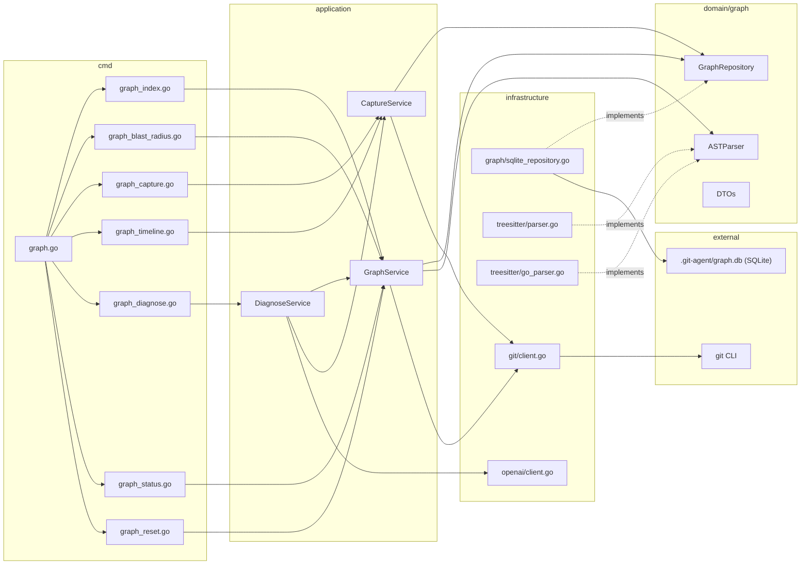

# Architecture: git-agent graph

## Clean Architecture Placement

The graph feature follows the existing 4-layer inward-dependency pattern:

```
cmd/graph*.go  -->  application/graph_*.go  -->  domain/graph/  <--  infrastructure/graph/
                                                                <--  infrastructure/treesitter/
```

Domain has zero external imports. SQLite (`modernc.org/sqlite`) and Tree-sitter
live exclusively in `infrastructure/`.

## Always-On Binary

The graph feature is compiled into every `git-agent` binary. There is no
`//go:build graph` tag, no separate `make build-graph` target, and no
conditional command registration. The `graph` subcommand is always available.

This simplifies distribution, CI, and user experience: one binary, one build,
one test invocation. The pure-Go SQLite driver (`modernc.org/sqlite`) requires
no CGo, no system libraries, and no platform-specific build steps.

## Package Structure

```
git-agent-cli/
  domain/
    graph/
      repository.go          # GraphRepository interface
      index.go               # IndexRequest, IndexResult, IndexStatus DTOs
      query.go               # BlastRadiusRequest, BlastRadiusResult, etc.
      session.go             # SessionNode, ActionNode, CaptureRequest, CaptureResult DTOs
      timeline.go            # TimelineRequest, TimelineResult, DiagnoseRequest, DiagnoseResult DTOs
      nodes.go               # CommitNode, FileNode, SymbolNode, AuthorNode
      edges.go               # Edge types, CO_CHANGED weight

  application/
    graph_service.go          # GraphService: Index, BlastRadius, Hotspots, Ownership, Status, Reset
    graph_capture_service.go  # CaptureService: Capture, EndSession, Timeline
    graph_diagnose_service.go # DiagnoseService: Diagnose (P2, requires LLM)

  infrastructure/
    graph/
      sqlite_client.go        # SQLite connection, WAL mode, schema DDL, lifecycle
      sqlite_repository.go    # GraphRepository impl: INSERT OR REPLACE, parameterized queries
      indexer.go              # Git history walker + incremental logic
      co_change.go            # CO_CHANGED edge computation

    treesitter/
      parser.go               # Language detection + gotreesitter wrapper
      extractor.go            # Symbol extraction (functions, classes, calls, imports)
      go_parser.go            # go/ast parser for Go files (higher precision)
      queries/                # Embedded .scm query files per language
        go.scm
        typescript.scm
        python.scm
        rust.scm
        java.scm

  cmd/
    graph.go                  # Root "graph" command (Cobra)
    graph_index.go            # "graph index" subcommand
    graph_blast_radius.go     # "graph blast-radius" subcommand
    graph_capture.go          # "graph capture" subcommand (P1b)
    graph_timeline.go         # "graph timeline" subcommand (P1b)
    graph_hotspots.go         # "graph hotspots" subcommand (P1a)
    graph_ownership.go        # "graph ownership" subcommand (P1a)
    graph_diagnose.go         # "graph diagnose" subcommand (P2)
    graph_status.go           # "graph status" subcommand
    graph_reset.go            # "graph reset" subcommand

  pkg/
    graph/
      format.go               # JSON/text output formatting for graph results
```

## Domain Interfaces

### GraphRepository

```go
type GraphRepository interface {
    // Lifecycle
    Open(ctx context.Context) error
    Close() error
    InitSchema(ctx context.Context) error
    Drop(ctx context.Context) error

    // Write (indexing)
    UpsertCommit(ctx context.Context, c CommitNode) error
    UpsertAuthor(ctx context.Context, a AuthorNode) error
    UpsertFile(ctx context.Context, f FileNode) error
    CreateModifies(ctx context.Context, commitHash, filePath, status string, additions, deletions int) error
    CreateAuthored(ctx context.Context, authorEmail, commitHash string) error
    ReplaceFileSymbols(ctx context.Context, filePath string, symbols []SymbolNode, calls []CallEdge, imports []ImportEdge) error
    RecomputeCoChanged(ctx context.Context, minCount int) error

    // State
    GetLastIndexedCommit(ctx context.Context) (string, error)
    SetLastIndexedCommit(ctx context.Context, hash string) error
    GetStats(ctx context.Context) (*GraphStats, error)

    // Read (queries)
    BlastRadius(ctx context.Context, req BlastRadiusRequest) (*BlastRadiusResult, error)
    Hotspots(ctx context.Context, req HotspotsRequest) (*HotspotsResult, error)
    Ownership(ctx context.Context, req OwnershipRequest) (*OwnershipResult, error)

    // Session/Action tracking (P1b)
    UpsertSession(ctx context.Context, s SessionNode) error
    CreateAction(ctx context.Context, a ActionNode) error
    CreateActionModifies(ctx context.Context, actionID, filePath string, additions, deletions int) error
    CreateActionProduces(ctx context.Context, actionID, commitHash string) error
    GetActiveSession(ctx context.Context, source string, timeoutMinutes int) (*SessionNode, error)
    EndSession(ctx context.Context, sessionID string) error
    Timeline(ctx context.Context, req TimelineRequest) (*TimelineResult, error)
    ActionsForFiles(ctx context.Context, filePaths []string, since int64) ([]ActionNode, error)

    // Raw SQL (power user)
    Query(ctx context.Context, sql string, params []any) ([]map[string]any, error)
}
```

Note: `Query` accepts `[]any` positional parameters (matching SQLite `?`
placeholders), not a `map[string]any`. All other methods use parameterized
statements internally -- never string concatenation.

### ASTParser

```go
type ASTParser interface {
    Parse(ctx context.Context, language string, source []byte) (*ParseResult, error)
    SupportedLanguages() []string
}

type ParseResult struct {
    Symbols []SymbolNode
    Calls   []CallEdge    // {from: symbol ID, to: symbol name, confidence}
    Imports []ImportEdge  // {from: file path, import_path: raw string, resolved: file path}
}
```

For Go files, `infrastructure/treesitter/go_parser.go` delegates to `go/ast`
for higher precision on function signatures, interface methods, and struct
fields. Other languages use gotreesitter with embedded `.scm` query files.

## Application Services

### GraphService (index + queries)

```go
type GraphService struct {
    repo   graph.GraphRepository
    parser graph.ASTParser
    git    GraphGitClient
}

// GraphGitClient extends the existing git client interface
type GraphGitClient interface {
    CommitLogDetailed(ctx context.Context, since string, max int) ([]graph.CommitInfo, error)
    FileContentAt(ctx context.Context, commitHash, filePath string) ([]byte, error)
    CurrentHead(ctx context.Context) (string, error)
    Diff(ctx context.Context) (string, error)            // unstaged + staged diff
    DiffFiles(ctx context.Context) ([]string, error)     // list of changed file paths
}
```

| Method | Description | Priority |
|--------|-------------|----------|
| `Index(ctx, req IndexRequest) (*IndexResult, error)` | Full or incremental index | P0 |
| `BlastRadius(ctx, req BlastRadiusRequest) (*BlastRadiusResult, error)` | Co-change + call chain | P0 |
| `Hotspots(ctx, req HotspotsRequest) (*HotspotsResult, error)` | Ranked change frequency | P1a |
| `Ownership(ctx, req OwnershipRequest) (*OwnershipResult, error)` | Author contribution | P1a |
| `Status(ctx) (*GraphStatus, error)` | DB metadata + row counts | P0 |
| `Reset(ctx) error` | Delete database file | P0 |

### CaptureService (session/action tracking -- P1b)

```go
type CaptureService struct {
    repo graph.GraphRepository
    git  GraphGitClient
}
```

| Method | Description |
|--------|-------------|
| `Capture(ctx, req CaptureRequest) (*CaptureResult, error)` | Record one action: read diff, create Session/Action rows + edges |
| `EndSession(ctx, sessionID string) error` | Mark session as ended |
| `Timeline(ctx, req TimelineRequest) (*TimelineResult, error)` | Query sessions/actions with filters |

### DiagnoseService (P2, requires LLM)

```go
type DiagnoseService struct {
    repo    graph.GraphRepository
    graph   *GraphService       // reuses BlastRadius
    capture *CaptureService     // reuses Timeline/ActionsForFiles
    llm     LLMClient           // existing OpenAI-compatible client
}

// LLMClient reuses the existing infrastructure/openai client interface
type LLMClient interface {
    Complete(ctx context.Context, prompt string) (string, error)
}
```

| Method | Description |
|--------|-------------|
| `Diagnose(ctx, req DiagnoseRequest) (*DiagnoseResult, error)` | Combine blast-radius + timeline + LLM reasoning to identify introducing action |

## CLI Wiring (Cobra)

Following the existing pattern in `cmd/commit.go` and `cmd/init.go`.
No build tag -- the command is always registered:

```go
// cmd/graph.go
var graphCmd = &cobra.Command{
    Use:   "graph",
    Short: "Query the code knowledge graph",
}

func init() {
    graphCmd.AddCommand(graphIndexCmd)
    graphCmd.AddCommand(graphBlastRadiusCmd)
    graphCmd.AddCommand(graphStatusCmd)
    graphCmd.AddCommand(graphResetCmd)
    rootCmd.AddCommand(graphCmd)
}
```

Each subcommand constructs the service with wired dependencies:

```go
// cmd/graph_index.go
var graphIndexCmd = &cobra.Command{
    Use:   "index",
    Short: "Build or update the code graph",
    RunE: func(cmd *cobra.Command, args []string) error {
        repo := sqlite.NewRepository(graphDBPath())
        parser := treesitter.NewParser()
        gitClient := git.NewClient()
        svc := application.NewGraphService(repo, parser, gitClient)
        defer repo.Close()

        result, err := svc.Index(cmd.Context(), application.IndexRequest{
            Force:             force,
            MaxCommits:        maxCommits,
            AST:               ast,
            MaxFilesPerCommit: maxFilesPerCommit,
        })
        // ... format and output result
    },
}
```

`graphDBPath()` returns `.git-agent/graph.db` -- a single file. SQLite WAL
mode creates two sidecar files (`graph.db-wal`, `graph.db-shm`) automatically;
these are managed by SQLite and must not be deleted independently.

## SQLite Schema

> **Authoritative schema**: See [_index.md](./_index.md) for the complete DDL
> with all tables, indexes, and constraints. This section highlights key
> design choices.

All tables are created in `InitSchema`. Session/Action tables (P1b) are
included in the DDL from day one but remain empty until the `capture` command
is implemented.

Key schema decisions:
- **Canonical co-change ordering**: `CHECK (file_a < file_b)` on `co_changed`
  prevents duplicate pairs
- **Natural primary keys**: commit hash, file path, composite symbol ID
  (`{file_path}:{kind}:{name}:{start_line}`)
- **Foreign keys**: enabled via `PRAGMA foreign_keys=ON` for referential integrity
- **WAL mode PRAGMAs**: set once at connection open before any queries

## Index Algorithm

```
1. Open SQLite at .git-agent/graph.db (create if missing)
2. Set PRAGMAs: journal_mode=WAL, busy_timeout=5000, foreign_keys=ON,
   synchronous=NORMAL, cache_size=-64000, mmap_size=268435456
3. InitSchema (CREATE TABLE IF NOT EXISTS for all tables)
4. Read index_state WHERE key = 'last_indexed_commit'
5. git log lastHash..HEAD --format=... --name-status
6. Begin transaction
7. For each commit (in chronological order):
   a. INSERT OR IGNORE INTO commits
   b. INSERT OR IGNORE INTO authors + INSERT OR IGNORE INTO authored
   c. For each modified file:
      - INSERT OR IGNORE INTO files
      - INSERT OR REPLACE INTO modifies
      - If --ast and file extension is supported:
        * git show commitHash:filePath
        * Parse: go/ast for .go files, gotreesitter for others
        * ReplaceFileSymbols: DELETE FROM symbols/calls/imports/contains_symbol
          WHERE file_path = ?, then batch INSERT new rows
8. Commit transaction
9. RecomputeCoChanged in a separate transaction:
   - DELETE FROM co_changed
   - INSERT INTO co_changed SELECT ... FROM modifies m1 JOIN modifies m2 ...
10. UPDATE index_state SET value = ? WHERE key = 'last_indexed_commit'
11. Return IndexResult with stats
```

Batch inserts use prepared statements with multiple value tuples per
`INSERT` (e.g., 500 rows per batch).

## Blast Radius Queries

### Phase 1: Co-change neighbors (P0)

```sql
SELECT
    CASE WHEN cc.file_a = ?1 THEN cc.file_b ELSE cc.file_a END AS neighbor,
    cc.coupling_count,
    cc.coupling_strength,
    'co-change' AS reason
FROM co_changed cc
WHERE (cc.file_a = ?1 OR cc.file_b = ?1)
  AND cc.coupling_count >= ?2
ORDER BY cc.coupling_strength DESC
LIMIT ?3
```

### Phase 2: Import reverse lookup (P1a)

```sql
SELECT i.from_file AS path, 'imports' AS reason
FROM imports i
WHERE i.to_file = ?
```

### Phase 3: Call chain via recursive CTE (P1a)

```sql
WITH RECURSIVE call_chain(symbol_id, file_path, depth, visited) AS (
    -- Base case: symbols in the target file
    SELECT s.id, s.file_path, 0, s.id
    FROM symbols s
    WHERE s.file_path = ?1

    UNION ALL

    -- Recursive step: follow CALLS edges outward
    SELECT c.to_symbol, s2.file_path, cc.depth + 1,
           cc.visited || '>' || c.to_symbol
    FROM call_chain cc
    JOIN calls c ON c.from_symbol = cc.symbol_id
    JOIN symbols s2 ON s2.id = c.to_symbol
    WHERE cc.depth < ?2                                    -- depth limit
      AND cc.visited NOT LIKE '%' || c.to_symbol || '%'   -- cycle prevention
)
SELECT DISTINCT file_path, 'call-dependency' AS reason
FROM call_chain
WHERE depth > 0 AND file_path <> ?1
```

### Phase 4: Symbol-level entry point (P1a)

When `--symbol` is provided:

```sql
WITH RECURSIVE callers(symbol_id, file_path, depth, visited) AS (
    SELECT s.id, s.file_path, 0, s.id
    FROM symbols s
    WHERE s.name = ?1 AND s.file_path = ?2

    UNION ALL

    SELECT c.from_symbol, s2.file_path, cl.depth + 1,
           cl.visited || '>' || c.from_symbol
    FROM callers cl
    JOIN calls c ON c.to_symbol = cl.symbol_id
    JOIN symbols s2 ON s2.id = c.from_symbol
    WHERE cl.depth < ?3
      AND cl.visited NOT LIKE '%' || c.from_symbol || '%'
)
SELECT DISTINCT
    s.file_path AS file,
    s.name AS symbol,
    s.kind AS kind
FROM callers cl
JOIN symbols s ON s.id = cl.symbol_id
WHERE cl.depth > 0
ORDER BY s.file_path
```

Results from all phases are merged, deduplicated by file path, and ranked
by coupling strength (co-change) then by reason type.

## Capture Algorithm (P1b)

```
1. Read git diff (unstaged + staged)
2. If diff is empty, return {"skipped": true} and exit 0
3. Open SQLite at .git-agent/graph.db (create if missing, init schema)
4. Begin transaction
5. Find active session for this source:
   SELECT id FROM sessions
   WHERE source = ? AND ended_at IS NULL
     AND started_at > ?  -- (now - timeout)
   ORDER BY started_at DESC LIMIT 1
6. If no active session:
   a. INSERT INTO sessions (id, source, started_at)
7. Compute next sequence:
   SELECT COALESCE(MAX(sequence), 0) + 1 FROM actions WHERE session_id = ?
8. INSERT INTO actions (id, session_id, tool, diff, files_changed, timestamp, message)
9. For each changed file:
   a. INSERT OR IGNORE INTO files (path)
   b. INSERT INTO action_modifies (action_id, file_path, additions, deletions)
10. Commit transaction
11. If --end-session: UPDATE sessions SET ended_at = ? WHERE id = ?
12. Return CaptureResult
```

Performance target: <200ms total. No LLM calls. No co-change recomputation.

## Action-to-Commit Linking

When `git-agent commit` produces a commit, it links preceding uncommitted
actions to the new Commit node:

```sql
-- Find unlinked actions that overlap with committed files
SELECT DISTINCT a.id
FROM actions a
JOIN action_modifies am ON am.action_id = a.id
LEFT JOIN action_produces ap ON ap.action_id = a.id
WHERE ap.action_id IS NULL
  AND a.timestamp > ?
  AND am.file_path IN (?, ?, ...)
```

Then `INSERT INTO action_produces` for each match. This runs inside the
existing commit flow (`cmd/commit.go`), bridging action-level and
commit-level history.

## Diagnose Algorithm (P2)

```
1. Parse input: bug description or file path
2. If file path:
   a. BlastRadius(filePath) -> affected files
   b. ActionsForFiles(affected + target, --since) -> candidate actions
3. If description:
   a. LLM: extract likely file paths from description
   b. BlastRadius for each -> affected files
   c. ActionsForFiles(affected, --since) -> candidate actions
4. Build context for LLM:
   a. Bug description
   b. Candidate actions (action ID, tool, timestamp, diff excerpt, files)
   c. Blast radius summary
5. LLM prompt: "Given this bug and these recent actions, which action
   most likely introduced it? Explain why and suggest a fix."
6. Parse LLM response into DiagnoseResult
7. Return ranked suspects with explanations
```

## Hook Integration Architecture

```
Agent (Claude Code)
  |
  | PostToolUse hook fires after Edit/Write/Bash
  |
  v
git-agent graph capture --source claude-code --tool $CLAUDE_TOOL_NAME
  |
  | 1. git diff (fast, local)
  | 2. Write Session/Action rows to SQLite
  | 3. Exit 0 (never block agent)
  |
  v
.git-agent/graph.db (sessions, actions, action_modifies rows)
  |
  | Later, user or agent queries:
  |
  +--> git-agent graph timeline --since 1h
  +--> git-agent graph diagnose "test failures"
  +--> git-agent graph blast-radius src/foo.go
```

Key design constraint: `capture` must never fail the hook. If SQLite is
locked or corrupt, log to stderr and exit 0. The agent must not be blocked.

## Concurrency and Locking

SQLite provides built-in locking; no external lock file is needed.

- **WAL mode**: Enabled at connection open (`PRAGMA journal_mode=WAL`). Allows
  concurrent readers during a write.
- **Busy timeout**: Set to 5000ms (`PRAGMA busy_timeout=5000`). If a write lock
  is held by another process, SQLite retries before returning `SQLITE_BUSY`.
- **Index**: Single writer. SQLite serializes writes automatically. Long
  transactions should use batched inserts to minimize lock hold time.
- **Capture**: Lightweight writer. If `SQLITE_BUSY` persists beyond the busy
  timeout, skip silently and exit 0 (agent must not be blocked). In practice,
  capture transactions are short (<50ms) so contention is rare.
- **Query**: Read-only. WAL mode allows queries to proceed concurrently with
  an active writer without blocking.
- **Reset**: Close connection, then `os.Remove(graph.db)`. SQLite sidecar files
  (`-wal`, `-shm`) are cleaned up automatically when the last connection closes.

For in-process concurrency (multiple goroutines sharing one `*sql.DB`), the
Go `database/sql` pool handles connection management. No additional
`sync.Mutex` is needed for the standard index/query/capture paths.

## Error Handling

| Condition | Behavior |
|-----------|----------|
| Graph not indexed | Exit code 3 with `{"error": "graph not indexed", "hint": "run 'git-agent graph index'"}` |
| SQLite corruption | `graph reset` deletes the file; re-index to recover |
| `SQLITE_BUSY` during index | Retry via busy_timeout (5s); if exhausted, exit 1 with lock error |
| `SQLITE_BUSY` during capture | Skip silently, exit 0 (never block agent hooks) |
| Unsupported language (AST) | Skip file, log warning in verbose mode |
| LLM unavailable (`--compress` / `diagnose`) | Exit 1 with `{"error": "LLM endpoint not configured"}` |

## Mermaid: Component Diagram



## Priority Summary

| Priority | Scope | Key Deliverables |
|----------|-------|------------------|
| P0 | Git history + co-change + blast-radius | `commits`, `files`, `authors`, `modifies`, `authored`, `co_changed` tables; `index` + `blast-radius` + `status` + `reset` commands |
| P1a | AST + symbols + CALLS/IMPORTS | `symbols`, `contains_symbol`, `calls`, `imports` tables; `--ast` flag on index; import/call-chain in blast-radius; `hotspots` + `ownership` commands |
| P1b | Action capture + timeline + hooks | `sessions`, `actions`, `action_modifies`, `action_produces` tables; `capture` + `timeline` commands; hook integration; action-to-commit linking |
| P2 | LLM compress + diagnose | `diagnose` command; LLM-powered analysis; `--compress` flag on timeline |
