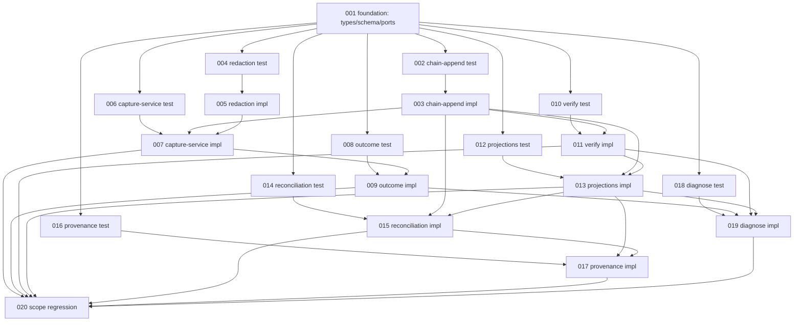

# Implementation Plan — Capture Event Log

Executable plan for the payload-observed, tamper-evident capture redesign.

- Design: [`../2026-06-25-capture-event-log-design/`](../2026-06-25-capture-event-log-design/_index.md)
- Base branch: `feat/code-graph-sqlite` (capture subsystem lives there; pre-merge redesign)
- Target: replace diff-reconstruction capture with an append-only, hash-chained
  Event Log; sessions/actions become replayable projections.

## Context

git-agent's capture subsystem reconstructs agent behavior by diffing the working
tree at `PostToolUse` time and comparing file hashes to a mutable `capture_baseline`
table. This is racy (concurrent agents misattributed), lossy (edit-then-revert nets
to `skipped`), and discards ground truth (`tool_input`/`tool_response` are parsed
away in `cmd/capture_payload.go`). Storage is mutable with no tamper-evidence — not
audit-grade. The subsystem is on the unmerged `feat/code-graph-sqlite` branch with
zero production data, so this is a clean pre-merge cut with no migration.

The plan replaces it with: **observe the hook payload verbatim → append to a
hash-chained Event Log (single source of truth) → derive sessions/actions/timeline
as replayable projections**, plus `graph verify` (tamper-evidence), `graph rebuild`,
`graph provenance`, `graph diagnose`, Bash outcome-event capture, and an
out-of-band reconciliation net. Scope is capture only; the code-graph index
(commits/files/AST/co-change/impact) is untouched.

### Current vs Target

| Dimension | Current (`feat/code-graph-sqlite`) | Target |
|---|---|---|
| Capture model | diff-reconstruction at hook time | verbatim payload observation |
| Source of truth | mutable `actions`/`sessions` + `capture_baseline` | append-only, hash-chained `events` |
| Payload fields kept | `tool_name`, `session_id` only | full payload (`tool_input`/`tool_response`/cwd/…), redacted |
| Sessions/actions | written at capture time | derived projections (replay/rebuild) |
| Integrity | none | hash chain + `graph verify` (4 break kinds) |
| Reverts/churn | erased (net `skipped`) | preserved as distinct events |
| Outcome (exit codes) | discarded | first-class Outcome Events |
| Out-of-band edits | invisible | `source=unknown` reconciliation events |
| Forensics | none | `graph diagnose` (suspect-window ranking) |
| Diff storage | 100KB-truncated text in `actions.Diff` | File Blob Refs in `event_files`, diff on demand |

## Execution Plan

```yaml
tasks:
  - id: "001"
    subject: "Foundation: event domain types, schema, repository ports"
    slug: "foundation"
    type: "setup"
    depends-on: []
  - id: "002"
    subject: "Hash chain & append (test)"
    slug: "chain-append-test"
    type: "test"
    depends-on: ["001"]
  - id: "003"
    subject: "Hash chain & append (impl)"
    slug: "chain-append-impl"
    type: "impl"
    depends-on: ["002"]
  - id: "004"
    subject: "Payload parse & redaction (test)"
    slug: "payload-redaction-test"
    type: "test"
    depends-on: ["001"]
  - id: "005"
    subject: "Payload parse & redaction (impl)"
    slug: "payload-redaction-impl"
    type: "impl"
    depends-on: ["004"]
  - id: "006"
    subject: "Capture service append-only & non-blocking (test)"
    slug: "capture-service-test"
    type: "test"
    depends-on: ["001"]
  - id: "007"
    subject: "Capture service append-only & non-blocking (impl)"
    slug: "capture-service-impl"
    type: "impl"
    depends-on: ["006", "003", "005"]
  - id: "008"
    subject: "Outcome events (test)"
    slug: "outcome-events-test"
    type: "test"
    depends-on: ["001"]
  - id: "009"
    subject: "Outcome events (impl)"
    slug: "outcome-events-impl"
    type: "impl"
    depends-on: ["008", "007"]
  - id: "010"
    subject: "graph verify chain integrity (test)"
    slug: "verify-test"
    type: "test"
    depends-on: ["001"]
  - id: "011"
    subject: "graph verify chain integrity (impl)"
    slug: "verify-impl"
    type: "impl"
    depends-on: ["010", "003"]
  - id: "012"
    subject: "Projections & rebuild (test)"
    slug: "projections-rebuild-test"
    type: "test"
    depends-on: ["001"]
  - id: "013"
    subject: "Projections & rebuild (impl)"
    slug: "projections-rebuild-impl"
    type: "impl"
    depends-on: ["012", "003", "011"]
  - id: "014"
    subject: "Out-of-band reconciliation (test)"
    slug: "reconciliation-test"
    type: "test"
    depends-on: ["001"]
  - id: "015"
    subject: "Out-of-band reconciliation (impl)"
    slug: "reconciliation-impl"
    type: "impl"
    depends-on: ["014", "003", "013"]
  - id: "016"
    subject: "graph provenance (test)"
    slug: "provenance-test"
    type: "test"
    depends-on: ["001"]
  - id: "017"
    subject: "graph provenance (impl)"
    slug: "provenance-impl"
    type: "impl"
    depends-on: ["016", "013", "015"]
  - id: "018"
    subject: "graph diagnose (test)"
    slug: "diagnose-test"
    type: "test"
    depends-on: ["001"]
  - id: "019"
    subject: "graph diagnose (impl)"
    slug: "diagnose-impl"
    type: "impl"
    depends-on: ["018", "009", "011", "013"]
  - id: "020"
    subject: "Scope-boundary regression (code index unaffected)"
    slug: "scope-regression"
    type: "test"
    depends-on: ["007", "009", "011", "013", "015", "017", "019"]
```

## Task File References

- [Task 001: Foundation](./task-001-foundation.md)
- [Task 002: Hash chain & append (test)](./task-002-chain-append-test.md)
- [Task 003: Hash chain & append (impl)](./task-003-chain-append-impl.md)
- [Task 004: Payload parse & redaction (test)](./task-004-payload-redaction-test.md)
- [Task 005: Payload parse & redaction (impl)](./task-005-payload-redaction-impl.md)
- [Task 006: Capture service (test)](./task-006-capture-service-test.md)
- [Task 007: Capture service (impl)](./task-007-capture-service-impl.md)
- [Task 008: Outcome events (test)](./task-008-outcome-events-test.md)
- [Task 009: Outcome events (impl)](./task-009-outcome-events-impl.md)
- [Task 010: graph verify (test)](./task-010-verify-test.md)
- [Task 011: graph verify (impl)](./task-011-verify-impl.md)
- [Task 012: Projections & rebuild (test)](./task-012-projections-rebuild-test.md)
- [Task 013: Projections & rebuild (impl)](./task-013-projections-rebuild-impl.md)
- [Task 014: Reconciliation (test)](./task-014-reconciliation-test.md)
- [Task 015: Reconciliation (impl)](./task-015-reconciliation-impl.md)
- [Task 016: graph provenance (test)](./task-016-provenance-test.md)
- [Task 017: graph provenance (impl)](./task-017-provenance-impl.md)
- [Task 018: graph diagnose (test)](./task-018-diagnose-test.md)
- [Task 019: graph diagnose (impl)](./task-019-diagnose-impl.md)
- [Task 020: Scope-boundary regression](./task-020-scope-regression.md)

## BDD Coverage

All 30 scenarios in `bdd-specs.md` are covered:

| Scenario cluster | Scenarios | Task |
|---|---|---|
| Observation (verbatim, edit-then-revert) | 2 | 006 |
| Observation (genesis, ground-truth retained) | 2 | 002 |
| Tamper-evidence (verify pass/edit/delete/insert/reorder) | 5 | 010 |
| Append-only enforced | 1 | 002 |
| Outcome events (failing/inferred/non-test) | 3 | 008 |
| Reconciliation (out-of-band, residual-only) | 2 | 014 |
| Redaction (token/path/oversized) | 3 | 004 |
| Non-blocking (lock contention) | 1 | 006 |
| Non-blocking (malformed, interactive) | 2 | 004 |
| Projections & rebuild (deterministic, concurrent, refuse-on-break) | 3 | 012 |
| Provenance (rename-aware + out-of-band) | 1 | 016 |
| Diagnosis (rank, low-confidence, refuse-tamper, LLM-bounded) | 4 | 018 |
| Scope boundary (index unaffected) | 1 | 020 |

## Dependency Chain

Verified acyclic in Phase 4 (no cycles, all references resolve, metadata agrees
with every task file).



### Parallelizable batches

```
Batch 1  001                                    foundation — blocks all
Batch 2  002 004 006 008 010 012 014 016 018    all RED tests, fully parallel
Batch 3  003 005                                impls whose only dep is their test
Batch 4  007  +  011                            007←003,005,006 ; 011←003,010
Batch 5  009  +  013                            009←007,008 ; 013←003,011,012
Batch 6  015  (+ 019 may start here)            015←003,013,014 ; 019←009,011,013,018
Batch 7  017                                    017←013,015,016
Batch 8  019  (if not started in Batch 6)       019←009,011,013,018
Batch 9  020                                    final scope-boundary regression gate
```

Note on `TEST-01`: this plan numbers test = N and impl = N+1 with a shared slug
(matching the skill's YAML example, e.g. `task-002-chain-append-test` ↔
`task-003-chain-append-impl`). The checklist's literal same-NNN grep flags this,
but all three reflection sub-agents confirmed every impl has its paired Red test
by slug. Pairing is correct; the mismatch is a checklist-vs-convention precision
note, not a defect.
